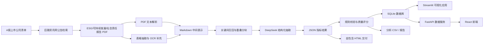

# ESG报告数据智能提取与分析系统

<p align="center">
  <strong>把上市公司 ESG PDF 报告转成可验证、可查询、可对比的数据资产</strong>
</p>

<p align="center">
  
  
  
  
  
  
</p>

<p align="center">
  <a href="./ESG分析系统_自包含版.html"><strong>零安装体验</strong></a> ·
  <a href="./技术文档.md"><strong>技术文档</strong></a> ·
  <a href="./使用说明.txt"><strong>使用说明</strong></a> ·
  <a href="./src"><strong>核心源码</strong></a> ·
  <a href="./frontend"><strong>React 前端</strong></a> ·
  <a href="./backend"><strong>FastAPI 后端</strong></a>
</p>

<p align="center">
  
</p>

> [!IMPORTANT]
> **评委最快体验方式**：下载本仓库后，直接双击打开 [`ESG分析系统_自包含版.html`](./ESG分析系统_自包含版.html)。该版本无需安装依赖、无需配置 API Key，可直接查看数据概览、ESG 排名、公司查询、指标对比、行业分析和智能检索等核心页面。

## 为什么值得先看

本项目面向“ESG 报告数据智能提取与分析”赛题，完成了从公开披露 PDF 报告到结构化 ESG 数据资产、质量校验、数据库入库、可视化分析和 AI 自然语言查询的端到端系统。它不是单页展示 Demo，而是一套可复现、可审计、可继续扩展的数据工程与智能分析流程。

| 评审关注点 | 本项目对应成果 |
|---|---|
| 可直接体验 | 提供 `ESG分析系统_自包含版.html`，打开即可查看 6 大页面 |
| 数据规模 | 当前已有 492 份结构化 JSON，覆盖 489 家上市公司 |
| 指标体系 | 覆盖 E/S/G 三大维度，共 52 个指标，其中 32 个定量指标、20 个定性指标 |
| 技术链路 | 报告下载、PDF 解析、表格抽取、文本分块、大模型抽取、规则校验、SQLite 入库、Web 展示完整闭环 |
| 可解释性 | 每条抽取结果保留指标、数值、单位、置信度、原文证据和质量校验信息 |
| 工程完整性 | 同时提供 Streamlit 应用、React + FastAPI 前后端、自包含 HTML、技术文档和运行脚本 |

## 项目成果一览

| 项目 | 当前结果 |
|---|---:|
| 结构化结果 JSON | 492 份 |
| 覆盖上市公司 | 489 家 |
| 定量抽取条目 | 12,154 条 |
| 定性抽取条目 | 7,976 条 |
| 定量有效条目 | 12,146 条 |
| 定性有效条目 | 7,968 条 |
| 平均质量分 | 0.689 |
| 平均完整度 | 78.7% |

## 系统页面

自包含版本面向快速评审，完整 AI 版本面向交互式分析。核心页面如下：

| 页面 | 解决的问题 | 主要能力 |
|---|---|---|
| 数据概览 | 当前数据资产有多完整 | 公司数、报告数、指标数、质量分、覆盖度概览 |
| ESG 排名 | 哪些公司 ESG 表现更好 | 综合评分、E/S/G 分维度评分、行业筛选、排名表 |
| 公司查询 | 单家公司披露了什么 | 公司维度查看定量指标、定性指标、年份和证据 |
| 指标对比 | 同一指标在公司间如何差异 | 多公司横向比较、单位展示、异常值观察 |
| 行业分析 | 不同行业 ESG 特征如何 | 行业覆盖度、行业均值、行业差异洞察 |
| 智能检索 | 如何快速定位公司和指标 | 按公司名、指标名、关键词检索结构化结果 |
| AI 智能助手 | 用自然语言查询 ESG 数据 | DeepSeek Function Calling 调用本地查询工具，回答排名、对比、趋势问题 |
| 数据质量 | 抽取结果是否可信 | 完整度、字段合法性、状态枚举、置信度和质量分展示 |

## 技术架构



## 快速开始

### 方式一：零安装体验

适合评委快速查看系统成果。

```text
双击打开 ESG分析系统_自包含版.html
```

说明：

- 无需安装 Python 或 Node.js。
- 无需配置 DeepSeek API Key。
- 首次加载 Plotly 图表时可能需要访问 CDN，之后浏览器可缓存。

### 方式二：启动完整 AI 版

适合查看 Streamlit 页面和 AI 智能助手。

```bash
pip install -r requirements.txt
```

在项目根目录创建 `.env`：

```bash
DEEPSEEK_API_KEY=sk-你的Key
```

启动应用：

```bash
python run.py app
```

也可以在 Windows 下直接运行：

```text
setup.bat
start.bat
```

默认访问地址：

```text
http://localhost:8501
```

### 方式三：启动 React + FastAPI 版

适合查看前后端分离实现。

```bash
pip install -r backend/requirements.txt
uvicorn backend.main:app --reload
```

```bash
cd frontend
npm install
npm run dev
```

## 完整数据处理链路

项目统一入口为 [`run.py`](./run.py)，各环节可以独立运行，也可以串联执行。

```bash
python run.py download     # 下载 ESG 报告 PDF
python run.py preprocess   # 解析 PDF 文本、表格和 OCR 内容
python run.py extract      # 调用 DeepSeek 抽取结构化 ESG 指标
python run.py validate     # 校验抽取结果并计算质量分
python run.py db-import    # 将 JSON 结果导入 SQLite
python run.py analyze      # 生成排名、行业分析和洞察报告
python run.py app          # 启动 Streamlit 可视化应用
python run.py all          # 一键运行主流程
```

## 核心脚本与方法

| 环节 | 文件 | 方法要点 |
|---|---|---|
| 公司清单生成 | [`scripts/generate_company_list.py`](./scripts/generate_company_list.py) | 使用 AkShare 获取 A 股代码和简称，生成 `data/company_list.csv` |
| 报告下载 | [`src/collector/downloader.py`](./src/collector/downloader.py) | 按公司、年份和 ESG 关键词检索巨潮资讯网公告，下载 PDF 并记录日志 |
| 数据源配置 | [`src/collector/sources.py`](./src/collector/sources.py) | 统一维护公告平台 URL、ESG 搜索关键词和数据源描述 |
| PDF 解析 | [`src/preprocessor/pdf_parser.py`](./src/preprocessor/pdf_parser.py) | 使用 pdfplumber、PyMuPDF 等工具提取正文、页码和 Markdown 中间文本 |
| 表格抽取 | [`src/preprocessor/table_extractor.py`](./src/preprocessor/table_extractor.py) | 抽取 PDF 表格并保存为结构化表格 JSON，保留表格语义 |
| OCR 补充 | [`src/preprocessor/ocr.py`](./src/preprocessor/ocr.py) | 对扫描页或低质量文本进行 OCR 补充，提高召回率 |
| 指标体系 | [`src/extractor/indicators.py`](./src/extractor/indicators.py) | 定义 52 个 ESG 指标、维度、类型、单位、关键词和说明 |
| Prompt 模板 | [`src/extractor/prompts.py`](./src/extractor/prompts.py) | 约束大模型输出 JSON 结构，要求数值、单位、证据、置信度完整返回 |
| 大模型抽取 | [`src/extractor/extractor.py`](./src/extractor/extractor.py) | 关键词筛选、重叠分块、DeepSeek 调用、JSON 解析、结果合并和成本统计 |
| 质量校验 | [`src/extractor/validator.py`](./src/extractor/validator.py) | 校验字段完整性、数值类型、单位、状态枚举和证据，输出质量分 |
| 数据库入库 | [`src/utils/db.py`](./src/utils/db.py) | 使用 SQLAlchemy 将公司、报告、定量指标和定性指标导入 SQLite |
| 数据分析 | [`src/analyzer.py`](./src/analyzer.py) | 计算 ESG 综合评分、行业分类、公司排名和分析报告 |
| AI 查询 | [`src/agent/query_engine.py`](./src/agent/query_engine.py) | 使用 DeepSeek Function Calling 调用本地工具完成自然语言查询 |
| Streamlit 应用 | [`src/app/main.py`](./src/app/main.py) | 构建数据概览、排名、查询、对比、行业分析、AI 助手等页面 |
| FastAPI 后端 | [`backend/main.py`](./backend/main.py) | 提供公司、指标、分析、对比、趋势、AI 等 REST API |
| React 前端 | [`frontend/src`](./frontend/src) | 使用 React、TypeScript、Ant Design、ECharts 构建前端交互页面 |
| 静态交付 | [`build_standalone.py`](./build_standalone.py) | 将数据和图表打包进单个 HTML，便于赛题提交和离线评审 |
| 报告生成 | [`generate_report.py`](./generate_report.py) | 基于分析结果生成图表和总结材料 |

更详细的“每个环节使用的方法和对应代码”见 [`技术文档.md`](./技术文档.md)。

## 项目结构

```text
esg-analysis-push/
├── ESG分析系统_自包含版.html    # 零安装演示入口
├── 技术文档.md                  # 完整技术说明与关键代码
├── 使用说明.txt                 # 面向评审的运行说明
├── run.py                       # 主流程命令入口
├── build_standalone.py          # 自包含 HTML 构建脚本
├── generate_report.py           # 分析报告生成脚本
├── requirements.txt             # Streamlit/AI/数据库依赖
├── data/
│   ├── company_list.csv          # 公司清单
│   ├── esg_data.db               # SQLite 数据库
│   ├── output/                   # 大模型抽取 JSON 结果
│   └── analysis/                 # ESG 评分、行业分析、洞察报告
├── src/
│   ├── collector/                # 报告检索与下载
│   ├── preprocessor/             # PDF、表格、OCR 预处理
│   ├── extractor/                # 指标体系、Prompt、LLM 抽取、校验
│   ├── agent/                    # AI 智能助手和工具调用
│   ├── app/                      # Streamlit 可视化应用
│   ├── utils/                    # 配置与数据库工具
│   └── analyzer.py               # ESG 评分和行业分析
├── backend/                      # FastAPI 后端服务
├── frontend/                     # React + TypeScript 前端
├── scripts/                      # 数据修复、迁移、同步和辅助脚本
└── tests/                        # 测试与验证材料
```

## 技术亮点

- **结构化抽取不是简单摘要**：系统要求模型输出固定 JSON Schema，并保留数值、单位、原文证据和置信度。
- **面向 ESG 场景的指标体系**：52 个指标覆盖环境、社会、治理三大维度，兼顾定量数值和定性披露。
- **PDF 表格与正文联合处理**：报告中的关键数据往往在表格内，系统保留表格结构以提高抽取准确率。
- **质量校验闭环**：抽取后通过规则校验字段合法性、空值、单位、数值类型和状态枚举，避免只展示模型原始输出。
- **多形态交付**：同一份数据资产可以通过 Streamlit、React + FastAPI、自包含 HTML 和分析报告多种方式展示。
- **自然语言查询可追溯**：AI 助手不直接编造答案，而是调用本地工具查询数据库后再组织回复。

## 文档索引

| 文档 | 内容 |
|---|---|
| [`使用说明.txt`](./使用说明.txt) | 最快运行方式、完整 AI 版启动步骤和提交材料清单 |
| [`技术文档.md`](./技术文档.md) | 全流程技术说明、脚本方法、关键代码和输入输出 |
| [`ESG网站建设方案.md`](./ESG网站建设方案.md) | Web 系统建设方案与功能规划 |
| [`Claude_Code_Prompt_ESG网站建设.md`](./Claude_Code_Prompt_ESG网站建设.md) | 系统建设 Prompt 与开发过程材料 |
| [`data/analysis/analysis_report.md`](./data/analysis/analysis_report.md) | 基于当前抽取结果生成的数据分析报告 |

## 评委建议阅读顺序

1. 先打开 [`ESG分析系统_自包含版.html`](./ESG分析系统_自包含版.html)，快速查看系统页面和数据成果。
2. 再阅读本 README 的“系统页面”“技术架构”“核心脚本与方法”部分，理解项目完整度。
3. 如果需要核查实现细节，进入 [`技术文档.md`](./技术文档.md) 和对应源码文件。
4. 如果需要运行完整 AI 版，按 [`使用说明.txt`](./使用说明.txt) 配置环境并启动 `python run.py app`。

