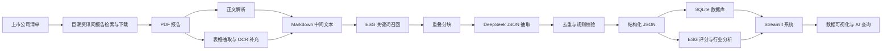

# ESG报告数据智能提取与分析系统

<p align="center">
  <strong>基于 Streamlit 的上市公司 ESG 报告抽取、质量评估与可视化分析平台</strong>
</p>

<p align="center">
  
  
  
  
  
  
</p>

<p align="center">
  <a href="./streamlit_app.py"><strong>Streamlit 入口</strong></a> ·
  <a href="./src/app/main.py"><strong>主应用源码</strong></a> ·
  <a href="./技术文档.md"><strong>技术文档</strong></a> ·
  <a href="./使用说明.txt"><strong>使用说明</strong></a> ·
  <a href="./run.py"><strong>流水线命令</strong></a>
</p>

<p align="center">
  
</p>

> [!IMPORTANT]
> **本仓库的评审系统只有 Streamlit 一个入口。** 请通过 `python run.py app` 或 `streamlit run streamlit_app.py` 启动系统。旧版单文件网页交付已经废弃并从仓库中移除，README、技术文档和使用说明均以 Streamlit 系统为准。

## 项目定位

本项目面向“ESG 报告数据智能提取与分析”场景，目标是把上市公司公开披露的 ESG 报告、可持续发展报告和社会责任报告，从非结构化 PDF 转换为可查询、可比较、可审计的结构化 ESG 数据资产，并通过 Streamlit 提供完整的交互式分析系统。

系统覆盖数据采集、PDF 解析、表格保留、大模型结构化抽取、质量校验、SQLite 入库、ESG 评分、行业分析、趋势分析和 AI 自然语言查询。评委进入仓库后，只需要关注 Streamlit 应用和 `run.py` 所串联的数据处理流水线。

## 评委快速运行

### Windows 推荐方式

```text
setup.bat
start.bat
```

启动后访问：

```text
http://localhost:8501
```

### 命令行方式

```bash
pip install -r requirements.txt
python run.py app
```

或直接运行 Streamlit Cloud 入口：

```bash
streamlit run streamlit_app.py
```

如果需要使用 AI 智能助手，请在项目根目录创建 `.env`：

```bash
DEEPSEEK_API_KEY=sk-你的Key
```

## 系统页面

| 页面 | 评审时能看到什么 | 对应源码 |
|---|---|---|
| 首页概览 | 数据规模、指标体系、行业覆盖、样本预览 | [`src/app/main.py`](./src/app/main.py) |
| 数据质量 | 质量分、完整度、无效值、公司画像和指标覆盖情况 | [`src/app/data_quality.py`](./src/app/data_quality.py) |
| 公司详情 | 单家公司定量指标、定性指标、年份和证据 | [`src/app/main.py`](./src/app/main.py) |
| 指标对比 | 多公司同一 ESG 指标横向比较 | [`src/app/main.py`](./src/app/main.py) |
| ESG分析 | ESG 综合评分、公司排名、行业分布和洞察 | [`src/analyzer.py`](./src/analyzer.py) |
| 趋势分析 | 华证评级趋势与历史指标变化 | [`src/app/pages/trends.py`](./src/app/pages/trends.py) |
| AI智能助手 | 自然语言查询、排名、对比和行业分析 | [`src/app/pages/ai_assistant.py`](./src/app/pages/ai_assistant.py) |
| 数据管理 | 数据加载状态、导入说明和处理结果检查 | [`src/app/main.py`](./src/app/main.py) |

## 当前数据成果

| 项目 | 当前结果 |
|---|---:|
| 结构化结果 JSON | 492 份 |
| 覆盖上市公司 | 489 家 |
| 定量抽取条目 | 12,154 条 |
| 定性抽取条目 | 7,976 条 |
| 定量有效条目 | 12,146 条 |
| 定性有效条目 | 7,968 条 |
| 平均质量分 | 0.689 |
| 平均完整度 | 78.7% |

指标体系共 52 项，覆盖环境 E、社会 S、治理 G 三个维度，其中定量指标 32 项、定性指标 20 项。

## 技术流程



## 数据处理命令

所有核心流程由 [`run.py`](./run.py) 统一管理：

```bash
python run.py download     # 下载 ESG 报告 PDF
python run.py preprocess   # PDF 正文、表格和 OCR 预处理
python run.py extract      # DeepSeek 抽取结构化 ESG 指标
python run.py validate     # 质量校验与完整度计算
python run.py db-import    # JSON 结果导入 SQLite
python run.py analyze      # ESG 评分、行业分析和洞察报告
python run.py app          # 启动 Streamlit 系统
python run.py all          # 串联主流程
```

## 核心脚本

| 环节 | 文件 | 作用 |
|---|---|---|
| 运行入口 | [`run.py`](./run.py) | 封装下载、预处理、抽取、校验、入库、分析和应用启动命令 |
| Streamlit 云入口 | [`streamlit_app.py`](./streamlit_app.py) | 面向 Streamlit Cloud 的启动文件 |
| 本地应用入口 | [`app.py`](./app.py) | 执行 `src/app/main.py` 的轻量入口 |
| 主应用 | [`src/app/main.py`](./src/app/main.py) | Streamlit 页面、导航、数据加载、图表和交互逻辑 |
| 指标体系 | [`src/extractor/indicators.py`](./src/extractor/indicators.py) | 定义 52 个 E/S/G 指标、单位、关键词和说明 |
| 报告下载 | [`src/collector/downloader.py`](./src/collector/downloader.py) | 检索并下载 ESG 报告 PDF，记录断点日志 |
| PDF 解析 | [`src/preprocessor/pdf_parser.py`](./src/preprocessor/pdf_parser.py) | 提取正文、页码和 Markdown 表格 |
| 表格抽取 | [`src/preprocessor/table_extractor.py`](./src/preprocessor/table_extractor.py) | 提取报告中的结构化表格并筛选 ESG 相关表 |
| OCR 补充 | [`src/preprocessor/ocr.py`](./src/preprocessor/ocr.py) | 处理扫描版或低文本密度 PDF |
| 大模型抽取 | [`src/extractor/extractor.py`](./src/extractor/extractor.py) | 关键词过滤、分块、调用 DeepSeek、合并去重 |
| Prompt 模板 | [`src/extractor/prompts.py`](./src/extractor/prompts.py) | 约束模型返回统一 JSON Schema |
| 质量校验 | [`src/extractor/validator.py`](./src/extractor/validator.py) | 校验字段、数值范围、状态枚举、质量分和完整度 |
| 数据库 | [`src/utils/db.py`](./src/utils/db.py) | SQLAlchemy ORM、SQLite 入库和统计查询 |
| 数据分析 | [`src/analyzer.py`](./src/analyzer.py) | ESG 评分、行业分类、排名和洞察生成 |
| AI 查询 | [`src/agent/query_engine.py`](./src/agent/query_engine.py) | DeepSeek Function Calling 与本地查询工具编排 |
| 查询工具 | [`src/agent/tools.py`](./src/agent/tools.py) | 公司查询、指标对比、排名、趋势和行业分析工具 |

## 项目结构

```text
esg-analysis-push/
├── README.md                     # GitHub 首页说明
├── 技术文档.md                   # Streamlit 单系统技术文档
├── 使用说明.txt                  # 评委运行说明
├── run.py                        # 数据流水线统一入口
├── app.py                        # 本地 Streamlit 轻量入口
├── streamlit_app.py              # Streamlit Cloud 入口
├── setup.bat / start.bat         # Windows 一键安装和启动
├── requirements.txt              # Streamlit 主系统依赖
├── data/
│   ├── company_list.csv          # 公司清单
│   ├── esg_data.db               # SQLite 数据库
│   ├── output/                   # 抽取后的 JSON 结果
│   └── analysis/                 # 评分、行业分析和洞察报告
├── src/
│   ├── app/                      # Streamlit 页面与样式
│   ├── collector/                # 报告采集
│   ├── preprocessor/             # PDF、表格、OCR 预处理
│   ├── extractor/                # 指标体系、大模型抽取、校验
│   ├── agent/                    # AI 智能助手
│   ├── utils/                    # 配置与数据库工具
│   └── analyzer.py               # ESG 数据分析引擎
├── scripts/                      # 数据修复、迁移和辅助脚本
└── tests/                        # 验证脚本和测试材料
```

## 本次清理说明

为避免评审入口混乱，仓库已经移除废弃的单文件网页交付产物及其构建脚本，同时清理错误截图等临时调试文件。当前 README 和技术文档只描述 Streamlit 系统。

## 文档索引

| 文档 | 内容 |
|---|---|
| [`使用说明.txt`](./使用说明.txt) | Streamlit 系统运行方式、AI Key 配置、提交材料说明 |
| [`技术文档.md`](./技术文档.md) | 各环节脚本方法、关键代码、输入输出和系统页面说明 |
| [`data/analysis/analysis_report.md`](./data/analysis/analysis_report.md) | 基于当前抽取结果生成的数据分析报告 |
