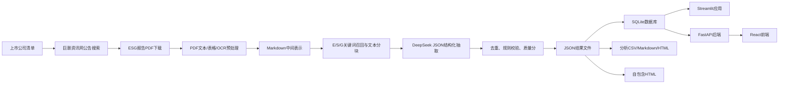

# ESG报告数据智能提取与分析系统技术文档

本文档基于当前项目源码编写，覆盖从上市公司清单生成、ESG报告下载、PDF预处理、大模型指标抽取、质量校验、数据库入库、统计分析、Web展示、AI助手、静态交付到论文材料生成的完整链路。文档中的代码摘录均来自本项目现有脚本，完整实现以对应源码文件为准。

## 1. 项目概览

项目目标是将上市公司公开披露的 ESG 报告、可持续发展报告、社会责任报告等非结构化 PDF 文档，转换为可查询、可对比、可审计的结构化 ESG 数据资产。系统围绕 E、S、G 三个维度定义指标体系，利用 PDF 解析、表格识别、关键词筛选、重叠分块、大模型结构化抽取、规则校验和可视化分析实现端到端处理。

当前项目的核心目录是 `esg-analysis-push/`。根目录还包含论文图表生成脚本、Markdown 转 Word 脚本和论文初稿材料。

当前 `data/output` 结果统计如下：

| 项目 | 当前值 |
|---|---:|
| 结构化结果 JSON | 492 份 |
| 覆盖公司 | 489 家 |
| 定量抽取条目 | 12,154 条 |
| 定性抽取条目 | 7,976 条 |
| 定量有效条目 | 12,146 条 |
| 定性有效条目 | 7,968 条 |
| 平均质量分 | 0.689 |
| 平均完整度 | 78.7% |

## 2. 总体架构

系统主链路可以分为六层：

1. 数据采集层：生成公司清单，并从巨潮资讯网下载 ESG 报告 PDF。
2. 文档预处理层：使用 `pdfplumber`、PyMuPDF、Camelot、PaddleOCR 将 PDF 转为 Markdown、表格 JSON 或 OCR 文本。
3. 指标抽取层：基于 DeepSeek API、指标体系、Prompt 模板和 Function Calling 风格的 JSON 输出进行结构化抽取。
4. 质量校验层：校验字段完整性、数值范围、状态枚举、单位，并计算质量分和完整度。
5. 数据服务层：将 JSON 导入 SQLite，使用 SQLAlchemy ORM 和 FastAPI/适配器提供查询。
6. 展示交付层：提供 Streamlit、React + FastAPI、自包含 HTML、Plotly 报告、论文图表和 Word 初稿。



## 3. 运行入口与主命令

项目主运行入口是 `run.py`。它把各个环节封装成统一命令：

```bash
python run.py download
python run.py preprocess
python run.py extract
python run.py validate
python run.py db-import
python run.py analyze
python run.py app
python run.py all
```

对应代码在 `run.py` 中定义命令映射：

```python
commands = {
    "download": cmd_download,
    "preprocess": cmd_preprocess,
    "extract": cmd_extract,
    "validate": cmd_validate,
    "db-import": cmd_db_import,
    "analyze": cmd_analyze,
    "app": cmd_app,
    "all": cmd_all,
}
```

完整流程由 `cmd_all()` 串联下载、预处理、抽取、校验和入库：

```python
def cmd_all():
    print("\n[1/4] 下载ESG报告...")
    cmd_download()

    print("\n[2/4] 预处理PDF...")
    cmd_preprocess()

    print("\n[3/4] 大模型提取指标...")
    cmd_extract()

    print("\n[4/4] 校验并导入数据库...")
    cmd_validate()
    cmd_db_import()
```

## 4. 环节一：上市公司清单生成

脚本：`scripts/generate_company_list.py`

作用：调用 AkShare 获取全 A 股股票代码和公司简称，输出 `data/company_list.csv`，供后续批量下载报告使用。

### 方法说明

- `ak.stock_info_a_code_name()` 获取股票代码和名称。
- `get_exchange()` 根据股票代码首位判断交易所。
- 输出字段为 `code,name,exchange,market`。

### 关键代码

```python
import akshare as ak

def get_exchange(code: str) -> tuple:
    prefix = code[0]
    if prefix == "6":
        return ("SSE", "沪市")
    return ("SZSE", "深市")

def main():
    df = ak.stock_info_a_code_name()
    with open(OUTPUT_PATH, "w", newline="", encoding="utf-8") as f:
        writer = csv.writer(f)
        writer.writerow(["code", "name", "exchange", "market"])
        for _, row in df.iterrows():
            code = str(row["code"]).zfill(6)
            name = str(row["name"]).strip()
            exchange, market = get_exchange(code)
            writer.writerow([code, name, exchange, market])
```

### 输入输出

| 项目 | 内容 |
|---|---|
| 输入 | AkShare 在线 A 股列表 |
| 输出 | `data/company_list.csv` |
| 后续用途 | 下载器读取公司代码和名称 |

## 5. 环节二：ESG报告下载

核心文件：`src/collector/downloader.py`

作用：从巨潮资讯网按股票代码和 ESG 关键词搜索公告，下载 PDF 报告，记录 `data/download_log.csv`，支持按公司和年份断点续传。

### 5.1 数据源配置

数据源定义在 `src/collector/sources.py`：

```python
@dataclass
class DataSource:
    name: str
    base_url: str
    search_url: str
    description: str

CNINFO = DataSource(
    name="巨潮资讯网",
    base_url="http://www.cninfo.com.cn",
    search_url="http://www.cninfo.com.cn/new/fulltextSearch",
    description="A股官方信息披露平台，覆盖沪深两市所有上市公司公告"
)
```

报告标题搜索关键词包括：

```python
ESG_KEYWORDS_FAST = ["ESG报告", "可持续发展报告", "社会责任报告"]
ESG_KEYWORDS_REST = [
    "环境、社会及管治报告", "环境、社会与管治报告",
    "企业社会责任报告", "ESG Report", "Sustainability Report", "CSR报告",
]
```

### 5.2 搜索公告

`ESGReportDownloader.search()` 调用巨潮资讯全文检索接口：

```python
def search(self, stock_code: str, keyword: str, page_size: int = 30) -> list:
    url = "http://www.cninfo.com.cn/new/fulltextSearch/full"
    params = {
        "searchkey": f"{keyword} {stock_code}",
        "pageNum": 1,
        "pageSize": page_size,
        "sortName": "pubdate",
        "sortType": "desc",
    }
    resp = self.session.get(url, params=params, timeout=30)
    resp.raise_for_status()
    data = resp.json()
    return data.get("announcements") or []
```

### 5.3 筛选有效 ESG PDF

下载器过滤非 PDF、英文版、摘要、目录、修订版等低价值公告：

```python
def _is_valid_announcement(self, ann: dict) -> bool:
    title = _clean_title(ann.get("announcementTitle", ""))
    adjunct_url = ann.get("adjunctUrl", "")

    if not adjunct_url.lower().endswith(".pdf"):
        return False
    if any(kw in title for kw in SKIP_TITLE_KEYWORDS):
        return False
    return True
```

### 5.4 多年度下载与断点续传

默认下载 2019 至 2026 年报告：

```python
DEFAULT_YEAR_RANGE = range(2019, 2027)
```

`find_and_download_multi_year()` 先收集所有公告，再按年份分组，每年选最佳公告下载：

```python
for target_year in sorted(year_range, reverse=True):
    target_str = str(target_year)
    log_key = f"{stock_code}_{target_str}"
    if log_key in self.processed_codes:
        continue

    candidates = by_year.get(target_str, [])
    if not candidates:
        candidates = [
            ann for ann in valid
            if target_str in _clean_title(ann.get("announcementTitle", ""))
        ]

    candidates.sort(
        key=lambda a: (
            "英文" in _clean_title(a.get("announcementTitle", "")),
            -(a.get("announcementTime", 0) or 0),
        )
    )
```

### 5.5 PDF下载与文件校验

下载时先读取前 10 字节验证 PDF 文件头：

```python
def download_pdf(self, url: str, filepath: Path, stock_code: str = "") -> bool:
    if filepath.exists() and filepath.stat().st_size > 10_000:
        return True

    resp = self.session.get(url, timeout=60, stream=True)
    resp.raise_for_status()

    first_bytes = next(resp.iter_content(chunk_size=10), b"")
    if b"%PDF" not in first_bytes:
        return False

    with open(filepath, "wb") as f:
        f.write(first_bytes)
        for chunk in resp.iter_content(chunk_size=8192):
            f.write(chunk)
```

### 输入输出

| 项目 | 内容 |
|---|---|
| 输入 | `data/company_list.csv` |
| 输出 | `data/pdfs/*.pdf`、`data/download_log.csv` |
| 关键类 | `ESGReportDownloader` |
| 调用入口 | `python run.py download` |

## 6. 环节三：下载日志同步和数据库任务初始化

脚本：`scripts/sync_db.py`

作用：将 `download_log.csv` 中下载成功的 PDF 记录同步到 SQLite 的 `companies` 和 `reports` 表，并将报告状态设为 `pending`。

### 方法说明

1. 读取 `company_list.csv`，建立股票代码到公司元数据的映射。
2. 读取 `download_log.csv` 中 `status == success` 的记录。
3. 如果公司不存在则插入 `companies`。
4. 如果同公司同年份报告不存在则插入 `reports`。
5. 如果报告已存在但路径为空，则更新 PDF 路径。

### 关键代码

```python
cursor.execute("SELECT id FROM companies WHERE stock_code = ?", (code,))
row = cursor.fetchone()
if row:
    company_id = row[0]
else:
    cursor.execute(
        "INSERT INTO companies (stock_code, name, exchange, market) VALUES (?, ?, ?, ?)",
        (code, name, exchange, market),
    )
    company_id = cursor.lastrowid

cursor.execute(
    "SELECT id FROM reports WHERE company_id = ? AND year = ?",
    (company_id, year),
)
row = cursor.fetchone()
if row:
    cursor.execute(
        "UPDATE reports SET pdf_path = ? WHERE id = ? AND (pdf_path IS NULL OR pdf_path = '')",
        (filepath, row[0]),
    )
else:
    cursor.execute(
        "INSERT INTO reports (company_id, year, title, pdf_path, extraction_status) VALUES (?, ?, ?, ?, ?)",
        (company_id, year, title[:300] if title else "", filepath, "pending"),
    )
```

### 辅助维护脚本

| 脚本 | 作用 | 核心方法 |
|---|---|---|
| `scripts/check_db.py` | 检查数据库报告路径与磁盘 PDF 是否一致 | 对比 `reports.pdf_path` 与 `data/pdfs` 文件集合 |
| `scripts/fix_missing.py` | 将磁盘已有但数据库缺失的 PDF 补入 `reports` | 从文件名解析股票代码、公司、年份 |
| `scripts/fix_bad_paths.py` | 找出数据库中不存在于磁盘的坏路径 | 统计坏路径是否已有抽取数据 |
| `scripts/cleanup_dup_reports.py` | 迁移重复报告的数据并删除坏记录 | 将 `extracted_values/texts.report_id` 指向正确报告 |
| `scripts/migrate_add_quality.py` | 给 `reports` 表补充质量字段并从 JSON 回填 | `ALTER TABLE` 加列，匹配 JSON 回填质量分 |

## 7. 环节四：PDF预处理

核心文件：

- `src/preprocessor/pdf_parser.py`
- `src/preprocessor/table_extractor.py`
- `src/preprocessor/ocr.py`
- `scripts/run_extraction_pipeline.py` 中的 `preprocess_pdf()`

目标是把 PDF 报告转换为模型更易理解的 Markdown 文本，并保留表格结构、页码和原文证据。

### 7.1 文本提取

`PDFParser.extract_text()` 优先使用 `pdfplumber`：

```python
def extract_text(self, pdf_path: Path) -> str:
    import pdfplumber

    all_text = []
    try:
        with pdfplumber.open(str(pdf_path)) as pdf:
            for i, page in enumerate(pdf.pages):
                text = page.extract_text()
                if text:
                    all_text.append(f"--- 第{i+1}页 ---\n{text}")
    except Exception as e:
        return self._extract_text_fallback(pdf_path)

    return "\n\n".join(all_text)
```

如果 `pdfplumber` 失败，则回退到 PyMuPDF：

```python
def _extract_text_fallback(self, pdf_path: Path) -> str:
    import fitz

    all_text = []
    doc = fitz.open(str(pdf_path))
    for i, page in enumerate(doc):
        text = page.get_text()
        if text:
            all_text.append(f"--- 第{i+1}页 ---\n{text}")
    doc.close()
    return "\n\n".join(all_text)
```

### 7.2 表格提取并转 Markdown

`PDFParser.extract_text_with_tables()` 同时提取文本和表格，将表格嵌入 Markdown：

```python
def extract_text_with_tables(self, pdf_path: Path) -> str:
    import pdfplumber

    parts = []
    with pdfplumber.open(str(pdf_path)) as pdf:
        for i, page in enumerate(pdf.pages):
            parts.append(f"--- 第{i+1}页 ---")
            tables = page.extract_tables()
            text = page.extract_text()
            if text:
                parts.append(text)
            if tables:
                for t_idx, table in enumerate(tables):
                    md_table = self._table_to_markdown(table)
                    if md_table:
                        parts.append(f"\n[表格 {t_idx+1}]\n{md_table}")
    return "\n\n".join(parts)
```

表格转 Markdown 的核心方法：

```python
def _table_to_markdown(self, table: list) -> str:
    clean_table = []
    for row in table:
        clean_row = [str(c).strip().replace("\n", " ") if c else "" for c in row]
        clean_table.append(clean_row)

    lines = []
    header = clean_table[0]
    lines.append("| " + " | ".join(h for h in header if h) + " |")
    lines.append("|" + "|".join(["---" for _ in header]) + "|")
    for row in clean_table[1:]:
        if any(cell for cell in row):
            lines.append("| " + " | ".join(cell for cell in row) + " |")
    return "\n".join(lines)
```

### 7.3 专用表格提取器

`TableExtractor` 使用 `pdfplumber` 和 `camelot` 两种方法：

```python
def extract_all(self, pdf_path: Path) -> List[dict]:
    tables = self.extract_with_pdfplumber(pdf_path)

    if len(tables) < 3:
        camelot_tables = self.extract_with_camelot(pdf_path)
        existing_pages = {t["page"] for t in tables}
        for ct in camelot_tables:
            if ct["page"] not in existing_pages:
                tables.append(ct)

    tables.sort(key=lambda t: (t["page"], t["index"]))
    return tables
```

筛选 ESG 相关表格依赖关键词：

```python
esg_keywords = [
    "排放", "碳", "能源", "水", "废", "员工", "培训",
    "安全", "薪酬", "董事", "环境", "治理", "温室气体",
    "GHG", "CO2", "NOx", "SOx", "MWh", "ESG",
]

score = sum(1 for kw in esg_keywords if kw.lower() in all_text.lower())
if score > 0:
    table["esg_keyword_score"] = score
    esg_tables.append(table)
```

### 7.4 OCR处理

`OCRProcessor` 使用 PaddleOCR，采用延迟加载方式，避免未使用 OCR 时增加启动成本：

```python
@property
def ocr(self):
    if self._ocr is None:
        from paddleocr import PaddleOCR
        self._ocr = PaddleOCR(
            use_angle_cls=True,
            lang="ch",
            use_gpu=False,
            show_log=False,
        )
    return self._ocr
```

当 PDF 页面普通文本少于阈值时，将页面渲染为图片再 OCR：

```python
pix = page.get_pixmap(dpi=200)
img_path = str(EXTRACTED_DIR / f"_ocr_temp_{pdf_path.stem}_p{page_num}.png")
pix.save(img_path)

ocr_text = self.extract_text_from_image(img_path)
if ocr_text:
    all_text.append(f"--- OCR 第{page_num+1}页 ---\n{ocr_text}")
```

### 输入输出

| 项目 | 内容 |
|---|---|
| 输入 | `data/pdfs/*.pdf` |
| 输出 | `data/extracted/*.md`、`*_tables.json`、`*_tables.md` |
| 主要方法 | `extract_text_with_tables()`、`batch_parse()`、`process_and_save()` |
| 调用入口 | `python run.py preprocess` 或 `python scripts/run_extraction_pipeline.py --step preprocess` |

## 8. 环节五：ESG指标体系定义

核心文件：`src/extractor/indicators.py`

项目用 `ESGIndicator` 数据类定义指标元数据，字段包括：

- `id`：唯一标识，如 `E_Q01`。
- `name`：中文指标名称。
- `name_en`：英文指标名称。
- `dimension`：E、S、G。
- `indicator_type`：`quantitative` 或 `qualitative`。
- `unit`：定量指标单位。
- `keywords`：召回和 Prompt 使用的关键词。
- `description`：指标说明。

### 关键代码

```python
@dataclass
class ESGIndicator:
    id: str
    name: str
    name_en: str
    dimension: str
    indicator_type: str
    unit: Optional[str] = None
    keywords: List[str] = field(default_factory=list)
    description: str = ""
```

环境指标示例：

```python
ESGIndicator(
    id="E_Q01", name="温室气体排放总量", name_en="Total GHG Emissions",
    dimension="E", indicator_type="quantitative", unit="吨二氧化碳当量(tCO2e)",
    keywords=["温室气体", "碳排放", "GHG", "CO2", "二氧化碳", "排放总量"],
    description="范围1+范围2温室气体排放总量"
)
```

指标集合按维度和类型汇总：

```python
ALL_INDICATORS = ENVIRONMENTAL_INDICATORS + SOCIAL_INDICATORS + GOVERNANCE_INDICATORS

INDICATORS_BY_DIMENSION = {
    "E": ENVIRONMENTAL_INDICATORS,
    "S": SOCIAL_INDICATORS,
    "G": GOVERNANCE_INDICATORS,
}

QUANTITATIVE_INDICATORS = [i for i in ALL_INDICATORS if i.indicator_type == "quantitative"]
QUALITATIVE_INDICATORS = [i for i in ALL_INDICATORS if i.indicator_type == "qualitative"]
```

## 9. 环节六：Prompt设计与大模型结构化抽取

核心文件：

- `src/extractor/prompts.py`
- `src/extractor/config.py`
- `src/extractor/extractor.py`
- `scripts/run_extraction_pipeline.py`

项目使用 DeepSeek API，模型配置在 `src/extractor/config.py`：

```python
DEEPSEEK_BASE_URL = "https://api.deepseek.com"
DEEPSEEK_MODEL = "deepseek-chat"
MAX_BUDGET_YUAN = 80.0
COST_PER_1K_INPUT = 0.001
COST_PER_1K_OUTPUT = 0.002
```

### 9.1 成本追踪

`CostTracker` 按输入和输出 token 计算费用，并在剩余预算不足时停止：

```python
@dataclass
class CostTracker:
    total_input_tokens: int = 0
    total_output_tokens: int = 0
    total_cost: float = 0.0
    call_count: int = 0
    errors: int = 0

    def record(self, input_tokens: int, output_tokens: int):
        self.total_input_tokens += input_tokens
        self.total_output_tokens += output_tokens
        self.total_cost += (
            input_tokens * COST_PER_1K_INPUT / 1000
            + output_tokens * COST_PER_1K_OUTPUT / 1000
        )
        self.call_count += 1

    def can_continue(self) -> bool:
        return self.remaining_budget > 1.0
```

### 9.2 系统提示词

`build_system_prompt()` 明确要求模型只提取客观存在的数据，输出 JSON：

```python
def build_system_prompt() -> str:
    return """你是一名专业的ESG（环境、社会和治理）数据分析师。你的任务是从上市公司ESG报告中精确提取关键指标。

## 核心要求

1. **定量指标**: 提取具体数值、单位、年份。如果报告未提及，字段留空(null)，不要编造数据。
2. **定性指标**: 提取原文关键描述（不超过200字），判断企业是否有相关政策/措施（yes/no/partial）。
3. **引用原文**: 尽可能提供原文出处，方便人工校验。
4. **注意单位**: 不同公司可能使用不同单位，请原样提取并标注单位。
"""
```

### 9.3 维度提示词

`build_dimension_prompt()` 只列出某一维度指标，用来降低 token 成本：

```python
def build_dimension_prompt(dimension: str) -> str:
    indicators = INDICATORS_BY_DIMENSION.get(dimension, [])
    dim_name = {"E": "环境", "S": "社会", "G": "治理"}.get(dimension, dimension)

    lines = [f"请从以下ESG报告内容中提取**{dim_name}维度**的指标。\n"]
    lines.append("## 定量指标：")
    for ind in indicators:
        if ind.indicator_type == "quantitative":
            lines.append(f"- [{ind.id}] {ind.name} ({ind.unit or '无固定单位'})")
```

### 9.4 合并提取模式

`ESGExtractor.extract_from_text()` 默认使用 `fast_mode=True` 时进行全维度合并提取，减少 API 调用：

```python
def extract_from_text(self, report_text: str, company_name: str = "",
                      report_year: str = "", dimension: Optional[str] = None,
                      fast_mode: bool = True) -> dict:
    all_results = {
        "company_name": company_name,
        "report_year": report_year,
        "quantitative_indicators": [],
        "qualitative_indicators": [],
    }

    if fast_mode and dimension is None:
        all_results = self._extract_combined(report_text, company_name, report_year)
    else:
        # 分维度提取
```

合并提取先用 E/S/G 全量关键词筛选相关段落：

```python
paragraphs = report_text.split("\n")
scored = []
for para in paragraphs:
    if len(para.strip()) < 10:
        continue
    score = sum(1 for kw in all_kw if kw in para)
    if score > 0:
        scored.append((score, para))

scored.sort(key=lambda x: -x[0])
keep_ratio = 0.35
keep_count = max(int(len(paragraphs) * keep_ratio), min(len(scored), 200))
kept = [para for _, para in scored[:keep_count]]
combined_text = "\n".join(kept)
```

### 9.5 文本分块

为了控制模型上下文长度，系统使用字符级重叠分块，并尽量在段落或句号处截断：

```python
CHUNK_SIZE = 15000
CHUNK_OVERLAP = 500

def _chunk_text(self, text: str) -> list:
    chunks = []
    start = 0
    text_len = len(text)

    while start < text_len:
        end = start + CHUNK_SIZE
        if end >= text_len:
            chunks.append(text[start:])
            break

        chunk = text[start:end]
        last_nl = max(
            chunk.rfind("\n\n"),
            chunk.rfind("\n"),
            chunk.rfind("。"),
            chunk.rfind("."),
        )
        if last_nl > CHUNK_SIZE * 0.5:
            end = start + last_nl + 1
            chunks.append(text[start:end])
            start = end - CHUNK_OVERLAP
        else:
            chunks.append(chunk)
            start = end - CHUNK_OVERLAP

    return chunks
```

### 9.6 API调用与 JSON 输出约束

`_extract_chunk_combined()` 使用 OpenAI 兼容 SDK 调 DeepSeek，并指定 `response_format={"type": "json_object"}`：

```python
response = self.client.chat.completions.create(
    model=DEEPSEEK_MODEL,
    messages=messages,
    temperature=0.1,
    max_tokens=4096,
    response_format={"type": "json_object"},
)

usage = response.usage
cost_tracker.record(
    input_tokens=usage.prompt_tokens,
    output_tokens=usage.completion_tokens,
)

content = response.choices[0].message.content
content = re.sub(r"^```(?:json)?\s*", "", content.strip())
content = re.sub(r"\s*```$", "", content)
return json.loads(content)
```

### 9.7 去重合并

多个 chunk 可能抽到同一指标，系统按指标 ID 去重，优先保留高置信度结果：

```python
def _deduplicate(self, items: list, is_quantitative: bool) -> list:
    seen = {}
    for item in items:
        ind_id = item.get("id", "")
        if not ind_id:
            continue
        if ind_id not in seen or (
            item.get("confidence") == "high"
            and seen[ind_id].get("confidence") != "high"
        ):
            seen[ind_id] = item
    return list(seen.values())
```

### 9.8 批处理流水线脚本

`scripts/run_extraction_pipeline.py` 是面向数据库 `pending` 报告的批处理编排脚本。主流程为：

```python
if args.step in ("preprocess", "all"):
    run_preprocess(pending)
if args.step in ("extract", "all"):
    run_extract(pending, limit=args.limit)
if args.step in ("import", "all"):
    run_db_import()
```

其中 `run_extract()` 对每份报告执行：

1. 找到 PDF 对应的 Markdown。
2. 如果已有 `_result.json` 则跳过。
3. 按 E/S/G 维度筛选文本。
4. 分块调用 DeepSeek。
5. 合并、去重、校验。
6. 保存到 `data/output/*_result.json`。

```python
for dim in ["E", "S", "G"]:
    dim_text = _filter_relevant_text(report_text, dim)
    if not dim_text:
        continue

    chunks = _chunk_text(dim_text)
    for ci, chunk in enumerate(chunks):
        prompt_template = build_dimension_prompt(dim)
        prompt = prompt_template.replace("{report_chunk}", chunk)

        response = client.chat.completions.create(
            model=DEEPSEEK_MODEL,
            messages=messages,
            temperature=0.1,
            max_tokens=4096,
            response_format={"type": "json_object"},
        )
```

## 10. 环节七：质量校验与完整度计算

核心文件：`src/extractor/validator.py`

质量校验器负责：

- 检查定量指标是否包含 `id/name/value/unit`。
- 检查数值类型是否为 `int` 或 `float`。
- 对关键指标做合理范围检查。
- 检查定性指标 `status` 是否为 `yes/no/partial`。
- 计算整体质量分和指标完整度。

### 10.1 合理范围规则

```python
REASONABLE_RANGES = {
    "E_Q01": (0, 1_000_000_000),
    "E_Q02": (0, 1_000_000_000),
    "E_Q03": (0, 1_000_000_000),
    "E_Q05": (0, 1_000_000_000),
    "E_Q06": (0, 100),
    "S_Q01": (10, 10_000_000),
    "S_Q02": (0, 100),
    "S_Q03": (0, 100),
    "G_Q01": (3, 50),
    "G_Q02": (0, 100),
    "G_Q04": (1, 100),
}
```

### 10.2 定量校验

```python
def _validate_quantitative(self, item: dict) -> List[str]:
    issues = []
    ind_id = item.get("id", "")
    if not ind_id:
        issues.append("缺少指标ID")
        return issues

    for field in ["name", "value", "unit"]:
        if field not in item:
            issues.append(f"缺少必填字段: {field}")

    value = item.get("value")
    if value is not None:
        if not isinstance(value, (int, float)):
            issues.append(f"value类型错误: {type(value).__name__}")

        if ind_id in self.REASONABLE_RANGES:
            lo, hi = self.REASONABLE_RANGES[ind_id]
            if isinstance(value, (int, float)) and (value < lo or value > hi):
                issues.append(f"数值{value}超出合理范围[{lo}, {hi}]")
```

### 10.3 定性校验

```python
def _validate_qualitative(self, item: dict) -> List[str]:
    issues = []
    ind_id = item.get("id", "")
    if not ind_id:
        issues.append("缺少指标ID")
        return issues

    status = item.get("status", "")
    if status and status not in ("yes", "no", "partial"):
        issues.append(f"status值无效: {status}（应为yes/no/partial）")

    if "summary" not in item:
        issues.append("缺少summary字段")

    return issues
```

### 10.4 质量分计算

质量分综合考虑覆盖数量、定量有效率和定性有效率：

```python
covered_count = sum(
    1 for item in qt_indicators + ql_indicators
    if item.get("value") is not None or item.get("status")
)
quality_score = min(
    1.0,
    (covered_count / max(len(ALL_INDICATORS), 1)) * 0.5
    + (qt_valid / max(qt_total, 1)) * 0.25
    + (ql_valid / max(ql_total, 1)) * 0.25,
)
```

### 10.5 完整度计算

```python
def check_completeness(self, extraction_result: dict) -> dict:
    extracted_ids = set()
    for item in extraction_result.get("quantitative_indicators", []):
        extracted_ids.add(item.get("id"))
    for item in extraction_result.get("qualitative_indicators", []):
        extracted_ids.add(item.get("id"))

    missing = []
    for ind in ALL_INDICATORS:
        if ind.id not in extracted_ids:
            missing.append({"id": ind.id, "name": ind.name, "type": ind.indicator_type})

    return {
        "total_indicators": len(ALL_INDICATORS),
        "extracted": len(extracted_ids),
        "missing": len(missing),
        "missing_list": missing,
        "completeness": round(len(extracted_ids) / len(ALL_INDICATORS) * 100, 1),
    }
```

## 11. 环节八：数据库设计与入库

核心文件：`src/utils/db.py`

数据库采用 SQLite，ORM 使用 SQLAlchemy。默认数据库路径：

```python
DB_PATH = BASE_DIR / "data" / "esg_data.db"
DATABASE_URL = f"sqlite:///{DB_PATH}"
```

### 11.1 数据表模型

公司表：

```python
class Company(Base):
    __tablename__ = "companies"

    id = Column(Integer, primary_key=True, autoincrement=True)
    stock_code = Column(String(10), unique=True, nullable=False, index=True)
    name = Column(String(100), nullable=False)
    exchange = Column(String(20))
    market = Column(String(20))
    industry = Column(String(50))
```

报告表：

```python
class Report(Base):
    __tablename__ = "reports"

    id = Column(Integer, primary_key=True, autoincrement=True)
    company_id = Column(Integer, ForeignKey("companies.id"), nullable=False)
    year = Column(Integer, nullable=False)
    title = Column(String(300))
    pdf_path = Column(String(500))
    md_path = Column(String(500))
    page_count = Column(Integer)
    extraction_status = Column(String(20), default="pending")
    quality_score = Column(Float, default=0.0)
    completeness = Column(Float, default=0.0)
```

指标定义表：

```python
class Indicator(Base):
    __tablename__ = "indicators"

    id = Column(String(20), primary_key=True)
    name = Column(String(100), nullable=False)
    name_en = Column(String(200))
    dimension = Column(String(1), nullable=False)
    indicator_type = Column(String(20), nullable=False)
    unit = Column(String(50))
    keywords = Column(JSON)
    description = Column(String(500))
```

定量结果表：

```python
class ExtractedValue(Base):
    __tablename__ = "extracted_values"

    id = Column(Integer, primary_key=True, autoincrement=True)
    report_id = Column(Integer, ForeignKey("reports.id"), nullable=False)
    indicator_id = Column(String(20), ForeignKey("indicators.id"), nullable=False)
    value = Column(Float)
    unit = Column(String(50))
    original_text = Column(Text)
    confidence = Column(String(10))
```

定性结果表：

```python
class ExtractedText(Base):
    __tablename__ = "extracted_texts"

    id = Column(Integer, primary_key=True, autoincrement=True)
    report_id = Column(Integer, ForeignKey("reports.id"), nullable=False)
    indicator_id = Column(String(20), ForeignKey("indicators.id"), nullable=False)
    status = Column(String(10))
    summary = Column(Text)
    original_text = Column(Text)
    confidence = Column(String(10))
```

### 11.2 导入指标定义

```python
def import_indicators(self, indicators: list):
    with self.Session() as session:
        for ind in indicators:
            existing = session.query(Indicator).filter_by(id=ind.id).first()
            if not existing:
                indicator = Indicator(
                    id=ind.id,
                    name=ind.name,
                    name_en=ind.name_en,
                    dimension=ind.dimension,
                    indicator_type=ind.indicator_type,
                    unit=ind.unit,
                    keywords=ind.keywords,
                    description=ind.description,
                )
                session.add(indicator)
        session.commit()
```

### 11.3 保存提取结果

```python
def save_extraction_result(self, report_id: int, result: dict):
    with self.Session() as session:
        for item in result.get("quantitative_indicators", []):
            value = ExtractedValue(
                report_id=report_id,
                indicator_id=item.get("id", ""),
                value=item.get("value"),
                unit=item.get("unit"),
                original_text=item.get("original_text"),
                confidence=item.get("confidence"),
            )
            session.add(value)

        for item in result.get("qualitative_indicators", []):
            text = ExtractedText(
                report_id=report_id,
                indicator_id=item.get("id", ""),
                status=item.get("status"),
                summary=item.get("summary"),
                original_text=item.get("original_text"),
                confidence=item.get("confidence"),
            )
            session.add(text)
```

### 11.4 从 JSON 批量导入

`import_results_from_json()` 是 JSON 到 SQLite 的主要导入入口：

```python
def import_results_from_json(db: Optional[Database] = None) -> dict:
    from src.extractor.indicators import ALL_INDICATORS

    if db is None:
        db = Database()

    db.import_indicators(ALL_INDICATORS)
    json_files = sorted(output_dir.glob("*_result.json"))
    stats = {"companies": 0, "reports": 0, "values": 0, "texts": 0, "errors": []}
```

## 12. 环节九：ESG评分、行业分析与洞察生成

核心文件：`src/analyzer.py`

该模块直接读取 `data/output/*_result.json`，将定量指标扁平化为 DataFrame，计算 ESG 得分、行业统计和关键洞察。

### 12.1 行业分类

行业分类使用公司名称关键词映射：

```python
INDUSTRY_MAP = [
    ("银行", "金融"), ("保险", "金融"), ("证券", "金融"),
    ("茅台", "食品饮料"), ("五粮液", "食品饮料"),
    ("医药", "医药"), ("制药", "医药"),
    ("石油", "能源"), ("煤炭", "能源"),
    ("科技", "科技"), ("海康", "科技"),
]

def classify_industry(name: str) -> str:
    for kw, ind in INDUSTRY_MAP:
        if kw in name:
            return ind
    return "其他"
```

### 12.2 数据加载

```python
def load_clean_data() -> pd.DataFrame:
    rows = []
    for f in sorted(OUTPUT_DIR.glob("*_result.json")):
        with open(f, "r", encoding="utf-8") as fp:
            r = json.load(fp)
        company = r.get("company_name", "")
        year = r.get("report_year", "")
        validation = r.get("validation", {})
        completeness = r.get("completeness", {})

        if completeness.get("completeness", 0) == 0:
            continue

        industry = classify_industry(company)
        quality = validation.get("overall_quality_score", 0)
        coverage = completeness.get("completeness", 0)

        for item in r.get("quantitative_indicators", []):
            val = item.get("value")
            if val is None or not isinstance(val, (int, float)):
                continue
            rows.append({
                "公司": company,
                "行业": industry,
                "年份": year,
                "指标ID": item.get("id"),
                "指标名称": item.get("name"),
                "数值": val,
                "单位": item.get("unit"),
                "质量分": quality,
                "覆盖度": coverage,
            })
    return pd.DataFrame(rows)
```

### 12.3 ESG得分计算

评分以可披露、可比较的关键指标构造 0 到 1 的维度得分。

环境维度：

```python
ghg = e_items[e_items["指标ID"] == "E_Q01"]["数值"]
if len(ghg) > 0 and ghg.iloc[0] > 0:
    e_score += 1
    e_count += 1

renewable = e_items[e_items["指标ID"] == "E_Q06"]["数值"]
if len(renewable) > 0:
    e_score += min(renewable.iloc[0] / 100, 1)
    e_count += 1

env_invest = e_items[e_items["指标ID"] == "E_Q10"]["数值"]
if len(env_invest) > 0 and env_invest.iloc[0] > 0:
    e_score += 1
    e_count += 1

scores["E_得分"] = round(e_score / max(e_count, 1), 3)
```

社会维度：

```python
training_hours = s_items[s_items["指标ID"] == "S_Q05"]["数值"]
if len(training_hours) > 0:
    s_score += min(training_hours.iloc[0] / 100, 1)

rd_ratio = s_items[s_items["指标ID"] == "S_Q08"]["数值"]
if len(rd_ratio) > 0:
    s_score += min(rd_ratio.iloc[0] / 20, 1)

female_ratio = s_items[s_items["指标ID"] == "S_Q02"]["数值"]
if len(female_ratio) > 0:
    s_score += min(female_ratio.iloc[0] / 50, 1)
```

治理维度：

```python
indep_ratio = g_items[g_items["指标ID"] == "G_Q02"]["数值"]
if len(indep_ratio) > 0:
    g_score += min(indep_ratio.iloc[0] / 50, 1)

board_meetings = g_items[g_items["指标ID"] == "G_Q04"]["数值"]
if len(board_meetings) > 0:
    g_score += min(board_meetings.iloc[0] / 12, 1)
```

综合得分：

```python
scores["ESG综合"] = round((scores["E_得分"] + scores["S_得分"] + scores["G_得分"]) / 3, 3)
```

### 12.4 分析结果输出

`run_full_analysis()` 输出：

- `data/analysis/esg_scores.csv`
- `data/analysis/industry_analysis.csv`
- `data/analysis/insights.csv`
- `data/analysis/analysis_report.md`

```python
scores.to_csv(ANALYSIS_DIR / "esg_scores.csv", index=False, encoding="utf-8-sig")
industries.to_csv(ANALYSIS_DIR / "industry_analysis.csv", index=False, encoding="utf-8-sig")
pd.DataFrame(insights).to_csv(ANALYSIS_DIR / "insights.csv", index=False, encoding="utf-8-sig")

report = _generate_report(scores, industries, insights, df)
report_path = ANALYSIS_DIR / "analysis_report.md"
with open(report_path, "w", encoding="utf-8") as f:
    f.write(report)
```

## 13. 环节十：数据覆盖率诊断

脚本：`analyze_data_coverage.py`

作用：统计 JSON 提取结果中的公司覆盖、年份分布、指标覆盖率、维度覆盖和完整度 Top/Bottom。

定量覆盖率统计：

```python
quant_coverage = defaultdict(lambda: {"filled": 0, "total": 0})
for r in records:
    for ind in r.get("quantitative_indicators", []):
        iid = ind["id"]
        quant_coverage[iid]["total"] += 1
        if ind.get("value") is not None:
            quant_coverage[iid]["filled"] += 1
```

定性覆盖率统计：

```python
qual_coverage = defaultdict(lambda: {"found": 0, "not_found": 0})
for r in records:
    for ind in r.get("qualitative_indicators", []):
        iid = ind["id"]
        status = ind.get("status", ind.get("found", False))
        if status and status != "no":
            qual_coverage[iid]["found"] += 1
        else:
            qual_coverage[iid]["not_found"] += 1
```

注意：该脚本当前的 `OUTPUT_DIR` 是一个历史绝对路径，迁移环境运行时需要改成当前项目目录，例如：

```python
OUTPUT_DIR = Path("esg-analysis-push/data/output")
```

## 14. 环节十一：华证ESG趋势数据构建

脚本：`scripts/build_huazheng_trend_data.py`

作用：把华证 ESG 季度评级 Excel 转为标准 JSON，用于趋势分析页。

### 方法说明

- 读取 Excel。
- 校验必要列。
- 将季度日期转为 `year` 和 `quarter`。
- 输出综合、E、S、G 的评级和得分。

### 关键代码

```python
def build_records(input_path: Path) -> list[dict]:
    df = pd.read_excel(input_path)
    required = {"证券代码", "季度日期", "证券简称", "综合得分", "E得分", "S得分", "G得分"}
    missing = required.difference(df.columns)
    if missing:
        raise ValueError(f"Excel缺少必要列: {', '.join(sorted(missing))}")

    df["季度日期"] = pd.to_datetime(df["季度日期"])
    df = df.sort_values(["证券代码", "季度日期"])

    records = []
    for _, row in df.iterrows():
        date = row["季度日期"]
        records.append({
            "stock_code": str(int(row["证券代码"])).zfill(6),
            "company": str(_value(row, "证券简称", "")),
            "date": date.strftime("%Y-%m-%d"),
            "year": int(date.year),
            "quarter": f"Q{((date.month - 1) // 3) + 1}",
            "rating": _value(row, "综合评级", ""),
            "composite_score": float(_value(row, "综合得分", 0)),
            "e_score": float(_value(row, "E得分", 0)),
            "s_score": float(_value(row, "S得分", 0)),
            "g_score": float(_value(row, "G得分", 0)),
        })
    return records
```

### 调用示例

```bash
python scripts/build_huazheng_trend_data.py --input "华证esg评级09.1-25.1（季度）.xlsx"
```

输出：`data/analysis/huazheng_esg_quarterly.json`

## 15. 环节十二：AI智能助手与自然语言查询

核心文件：

- `src/agent/data_adapter.py`
- `src/agent/tools.py`
- `src/agent/query_engine.py`
- `src/app/pages/ai_assistant.py`

### 15.1 数据适配层

`ESGDataAdapter` 预加载所有 JSON 结果，构建 DataFrame、评分表、行业分析、公司索引和洞察数据，为工具调用提供统一查询接口。

```python
class ESGDataAdapter:
    def __init__(self):
        self.indicator_map = {i.id: i for i in ALL_INDICATORS}
        self._load_raw_results()
        self._build_df()
        self._compute_scores()
        self._build_industry_analysis()
        self._build_company_index()
        self._build_insights()
```

构建扁平化 DataFrame：

```python
def _build_df(self):
    rows = []
    for r in self.raw_results:
        company = r.get("company_name", "")
        year = r.get("report_year", "")
        validation = r.get("validation", {})
        completeness = r.get("completeness", {})
        quality = validation.get("overall_quality_score", 0)
        coverage = completeness.get("completeness", 0)

        if coverage == 0:
            continue

        industry = _classify_industry(company)

        for item in r.get("quantitative_indicators", []):
            val = item.get("value")
            if val is None or not isinstance(val, (int, float)):
                continue
            rows.append({
                "公司": company,
                "行业": industry,
                "年份": year,
                "指标ID": item.get("id"),
                "指标名称": item.get("name", ""),
                "数值": val,
                "单位": item.get("unit", ""),
                "质量分": quality,
                "覆盖度": coverage,
            })

    self.df = pd.DataFrame(rows)
```

### 15.2 工具 Schema

`src/agent/tools.py` 定义 Function Calling 工具，包括：

- `list_companies`
- `get_indicators`
- `get_company_data`
- `get_esg_scores`
- `compare_companies`
- `get_industry_analysis`
- `get_trend`
- `get_data_overview`

工具定义示例：

```python
{
    "type": "function",
    "function": {
        "name": "get_company_data",
        "description": "获取指定公司的全部ESG指标数据，包括定量指标和定性指标，以及该公司的ESG评分。",
        "parameters": {
            "type": "object",
            "properties": {
                "company_name": {"type": "string", "description": "公司全称"},
                "dimension": {"type": "string", "enum": ["E", "S", "G"]}
            },
            "required": ["company_name"]
        }
    }
}
```

工具分发器：

```python
def execute_tool(name: str, arguments: dict, adapter) -> str:
    try:
        if name == "list_companies":
            result = adapter.get_companies(industry=arguments.get("industry"))
        elif name == "get_company_data":
            result = adapter.get_company_data(
                company_name=arguments.get("company_name", ""),
                dimension=arguments.get("dimension"),
            )
        elif name == "get_esg_scores":
            result = adapter.get_esg_scores(
                top_n=arguments.get("top_n", 10),
                company_names=arguments.get("company_names"),
            )
        else:
            result = {"error": f"未知工具: {name}"}
    except Exception as e:
        result = {"error": str(e), "traceback": traceback.format_exc()[-500:]}

    json_str = json.dumps(result, ensure_ascii=False, default=str)
    if len(json_str) > 8000:
        json_str = json_str[:8000] + '...\n[结果已截断]'
    return json_str
```

### 15.3 Agent查询循环

`ESGQueryAgent.query()` 通过 DeepSeek Function Calling 循环调用工具，最多 5 轮，超时 60 秒：

```python
for iteration in range(max_iterations):
    if time.time() - start_time > QUERY_TIMEOUT:
        return {"text": "抱歉，查询超时。请尝试简化您的问题。"}

    response = self.client.chat.completions.create(
        model=DEEPSEEK_MODEL,
        messages=messages,
        tools=self.tools,
        tool_choice="auto",
        temperature=0.3,
        max_tokens=2048,
        timeout=30,
    )

    msg = response.choices[0].message

    if msg.tool_calls:
        messages.append(msg.model_dump())
        for tc in msg.tool_calls:
            tool_name = tc.function.name
            tool_args = json.loads(tc.function.arguments)
            tool_result = execute_tool(tool_name, tool_args, self.adapter)
            messages.append({
                "role": "tool",
                "tool_call_id": tc.id,
                "content": tool_result,
            })
    else:
        return {"text": msg.content, "tool_calls_made": tool_calls_made}
```

### 15.4 Streamlit AI助手页面

`src/app/pages/ai_assistant.py` 使用 `st.chat_input()` 接收用户问题，并根据工具调用自动生成图表：

```python
user_input = st.chat_input("请输入您的ESG数据问题，例如：比亚迪的ESG表现怎么样？")

if query:
    st.session_state.messages.append({"role": "user", "content": query})
    result = st.session_state.agent.query(query, chat_history=chat_history)
    text = result.get("text", "")
    tool_calls = result.get("tool_calls_made", [])
    figs, tables = _auto_visualize(tool_calls, st.session_state.adapter)
```

自动可视化示例：当调用 `get_esg_scores` 时生成排名柱状图：

```python
if "get_esg_scores" in tool_names and not adapter.scores.empty:
    top_n = tc_data.get("get_esg_scores", {}).get("top_n", 10)
    top = adapter.scores.head(top_n).copy()
    fig = px.bar(
        top, x="ESG综合", y="公司", orientation="h",
        title=f"ESG综合得分 TOP{min(top_n, len(top))}",
        color="ESG综合", color_continuous_scale="blues",
    )
    figs.append(fig)
```

## 16. 环节十三：Streamlit可视化应用

核心文件：

- `src/app/main.py`
- `src/app/data_quality.py`
- `src/app/pages/trends.py`
- `src/app/pages/ai_assistant.py`
- `src/app/styles.py`

Streamlit 应用包含八个页面：

1. 首页概览
2. 数据质量
3. 公司详情
4. 指标对比
5. ESG分析
6. 趋势分析
7. AI智能助手
8. 数据管理

### 16.1 数据加载

应用优先从 SQLite 读取已完成报告；如果数据库不可用，则回退到 JSON 文件：

```python
@st.cache_data
def load_all_results() -> list:
    db = get_db()
    if db:
        try:
            stats = db.get_statistics()
            if stats["reports_done"] > 0:
                return _load_from_database(db)
        except Exception:
            pass

    return _load_from_json()
```

数据库加载时将 ORM 结果重新组装成 JSON 风格结构：

```python
def _load_from_database(db) -> list:
    results = []
    session = db.get_session()
    reports = session.query(Report).filter_by(extraction_status="done").all()
    for report in reports:
        result = {
            "company_name": report.company.name if report.company else "",
            "report_year": str(report.year),
            "quantitative_indicators": [],
            "qualitative_indicators": [],
            "validation": {
                "overall_quality_score": report.quality_score or 0,
                "quantitative_valid": sum(1 for v in report.values if v.value is not None),
                "quantitative_count": len(report.values),
            },
            "completeness": {
                "total_indicators": 52,
                "extracted": len(set(v.indicator_id for v in report.values) | set(t.indicator_id for t in report.texts)),
                "completeness": report.completeness or 0,
            },
        }
```

### 16.2 结果 DataFrame 构建

```python
def build_dataframe(results: list) -> pd.DataFrame:
    rows = []
    for r in results:
        company = r.get("company_name", "")
        year = r.get("report_year", "")
        validation = r.get("validation", {})
        completeness = r.get("completeness", {})
        quality = validation.get("overall_quality_score", 0)
        coverage = completeness.get("completeness", 0)

        for item in r.get("quantitative_indicators", []):
            rows.append({
                "公司": company,
                "年份": year,
                "指标ID": item.get("id", ""),
                "指标名称": item.get("name"),
                "数值": item.get("value"),
                "单位": item.get("unit"),
                "类型": "定量",
                "质量分": quality,
                "覆盖度": coverage,
            })
```

### 16.3 质量页辅助函数

`src/app/data_quality.py` 提供前端质量统计：

```python
def is_valid_quantitative(item: dict) -> bool:
    return isinstance(item.get("value"), (int, float))

def is_valid_qualitative(item: dict) -> bool:
    status = (item.get("status") or "").strip().lower()
    text = f"{item.get('summary') or ''}{item.get('original_text') or ''}".strip()
    return status in {"yes", "partial"} or (bool(text) and status != "no")
```

构建问题明细：

```python
def build_validation_detail(result: dict) -> dict:
    validator = ESGValidator()
    validation = validator.validate(result)
    completeness = validator.check_completeness(result)
    issues = []

    for item in result.get("quantitative_indicators", []):
        if not is_valid_quantitative(item):
            issues.append({
                "指标ID": item.get("id", ""),
                "指标名称": _indicator_name(item.get("id", ""), item.get("name", "")),
                "问题类型": "缺失定量数值",
                "建议处理": "复核原报告表格或文本，无法确认时不纳入数值对比。",
            })
```

### 16.4 趋势分析页

`src/app/pages/trends.py` 将华证季度评级和 JSON 抽取指标融合展示。

读取华证趋势：

```python
@st.cache_data(show_spinner=False)
def load_huazheng_quarterly() -> pd.DataFrame:
    rows = json.loads(HUAZHENG_PATH.read_text(encoding="utf-8"))
    df = pd.DataFrame(rows)
    for col in ["composite_score", "e_score", "s_score", "g_score"]:
        df[col] = pd.to_numeric(df[col], errors="coerce")
    df["year"] = df["year"].astype(str)
    return df
```

读取 JSON 年度指标：

```python
@st.cache_data(show_spinner=False)
def load_json_indicator_points() -> dict[str, list[dict]]:
    reports_by_code = {}
    for path in sorted(OUTPUT_DIR.glob("*_result.json")):
        code, file_year = _parse_file_meta(path)
        raw = json.loads(path.read_text(encoding="utf-8"))
        year = str(raw.get("report_year") or file_year or "")
        points = []
        for item in raw.get("quantitative_indicators", []):
            ind_id = item.get("id") or item.get("indicator_id")
            value = item.get("value")
            if ind_id not in KEY_INDICATORS or value is None:
                continue
            points.append({
                "year": year,
                "indicator_id": ind_id,
                "indicator": item.get("name") or ind_id,
                "value": float(value),
                "unit": item.get("unit") or "",
            })
        reports_by_code.setdefault(code, []).append({"year": year, "points": points})
    return reports_by_code
```

## 17. 环节十四：FastAPI后端

核心目录：`backend/`

FastAPI 入口是 `backend/main.py`，它注册了多个路由：

```python
from backend.routers import data, companies, indicators, analysis, comparison, ai, trends, benchmark

app.include_router(data.router, prefix="/api")
app.include_router(companies.router, prefix="/api")
app.include_router(indicators.router, prefix="/api")
app.include_router(analysis.router, prefix="/api")
app.include_router(comparison.router, prefix="/api")
app.include_router(ai.router, prefix="/api")
app.include_router(trends.router, prefix="/api")
app.include_router(benchmark.router, prefix="/api")
```

共享依赖通过 `backend/dependencies.py` 缓存：

```python
@lru_cache(maxsize=1)
def get_adapter() -> ESGDataAdapter:
    return ESGDataAdapter()

def get_db():
    db_path = Path(__file__).parent.parent / "data" / "esg_data.db"
    if db_path.exists():
        return Database(str(db_path))
    return None
```

### 17.1 数据概览 API

`backend/routers/data.py`

```python
@router.get("/overview")
def get_overview():
    adapter = get_adapter()
    base = adapter.get_data_overview()

    industry_distribution = []
    for ind_name, count in (
        adapter.df.groupby("行业")["公司"].nunique().sort_values(ascending=False).items()
    ):
        industry_distribution.append({"industry": ind_name, "count": int(count)})

    return {
        "companies": base.get("公司数", 0),
        "reports": base.get("报告数", 0),
        "industries": base.get("行业数", 0),
        "avg_quality_score": base.get("平均质量分", 0),
        "industry_distribution": industry_distribution,
    }
```

### 17.2 公司详情 API

`backend/routers/companies.py`

```python
@router.get("/companies/{company_name}")
def get_company_detail(company_name: str, dimension: str | None = Query(None)):
    adapter = get_adapter()
    data = adapter.get_company_data(company_name, dimension=dimension)

    if "error" in data:
        raise HTTPException(status_code=404, detail=data["error"])

    return CompanyDetail(
        stock_code="",
        name=company_name,
        industry=data.get("行业", ""),
        report_year=data.get("年份", ""),
        quality_score=data.get("质量分", 0),
        coverage=data.get("覆盖度", 0),
        esg_scores=esg_scores,
        quantitative_indicators=quantitative,
        qualitative_indicators=qualitative,
    )
```

### 17.3 指标与分析 API

主要接口：

| 路由 | 方法 | 作用 |
|---|---|---|
| `/api/indicators` | GET | 查询指标体系 |
| `/api/indicators/{indicator_id}` | GET | 查询某指标详情和公司排名 |
| `/api/analysis/esg-scores` | GET | ESG 综合排名 |
| `/api/analysis/industries` | GET | 行业分析 |
| `/api/analysis/insights` | GET | 关键洞察 |
| `/api/analysis/distributions` | GET | E/S/G 得分分布 |

分布计算示例：

```python
counts, bin_edges = np.histogram(data.values, bins=25, range=(0, 1))
bin_centers = (bin_edges[:-1] + bin_edges[1:]) / 2
bins = [DistributionBin(center=round(float(c), 3), count=int(n)) for c, n in zip(bin_centers, counts)]
```

### 17.4 对比、趋势和对标 API

主要接口：

| 路由 | 方法 | 作用 |
|---|---|---|
| `/api/comparison` | GET | 单指标公司 TopN 对比 |
| `/api/comparison/multi` | GET | 多公司多指标对比 |
| `/api/comparison/matrix` | POST | 公司乘指标矩阵和行业均值 |
| `/api/trends/company/{company_name}` | GET | 公司 ESG 趋势 |
| `/api/trends/industry/{industry}` | GET | 行业趋势 |
| `/api/trends/indicator/{indicator_id}` | GET | 指标行业年度趋势 |
| `/api/benchmark/industry/{industry}` | GET | 行业基准统计 |
| `/api/benchmark/company/{company_name}` | GET | 公司与行业基准对比 |
| `/api/investment/screen` | POST | 投资筛选 |
| `/api/policy/compliance` | GET | 披露合规分析 |

行业基准统计代码：

```python
vals = group["数值"].dropna()
results.append(IndustryBenchmark(
    industry=industry,
    company_count=int(group["公司"].nunique()),
    indicator_id=ind_id,
    indicator_name=ind_def.name,
    unit=ind_def.unit or "",
    mean=round(float(vals.mean()), 3),
    median=round(float(vals.median()), 3),
    p25=round(float(vals.quantile(0.25)), 3),
    p75=round(float(vals.quantile(0.75)), 3),
    min_val=round(float(vals.min()), 3),
    max_val=round(float(vals.max()), 3),
))
```

## 18. 环节十五：React前端与静态数据包

核心目录：`frontend/`

前端技术栈：

- React 19
- Vite
- React Router
- Zustand
- Axios
- ECharts / Plotly 风格页面
- Tailwind CSS
- Ant Design / Heroicons

### 18.1 路由结构

`frontend/src/App.tsx`

```tsx
<Routes>
  <Route path="/" element={<Layout />}>
    <Route index element={<Home />} />
    <Route path="companies" element={<Companies />} />
    <Route path="comparison" element={<Comparison />} />
    <Route path="indicators" element={<Indicators />} />
    <Route path="analysis" element={<Analysis />} />
    <Route path="trends" element={<Trends />} />
    <Route path="policy" element={<Policy />} />
    <Route path="ai-assistant" element={<AIAssistant />} />
    <Route path="reports" element={<Reports />} />
    <Route path="*" element={<NotFound />} />
  </Route>
</Routes>
```

### 18.2 API客户端

`frontend/src/api/client.ts`

```ts
import axios from 'axios';

const apiClient = axios.create({
  baseURL: '/api',
  timeout: 30000,
  headers: { 'Content-Type': 'application/json' },
});

export default apiClient;
```

首页获取概览：

```tsx
useEffect(() => {
  apiClient.get<OverviewData>('/overview')
    .then((res) => setOverview(res.data))
    .catch(console.error);
}, [setOverview]);
```

### 18.3 前端类型定义

`frontend/src/types/index.ts` 定义前后端数据契约：

```ts
export interface CompanyDetail extends Company {
  report_year: string;
  quality_score: number;
  coverage: number;
  esg_scores?: ESGScores;
  quantitative_indicators: IndicatorValue[];
  qualitative_indicators: QualitativeValue[];
}

export interface ESGScoreRow {
  排名: number;
  公司: string;
  行业: string;
  E_得分: number;
  S_得分: number;
  G_得分: number;
  ESG综合: number;
}
```

### 18.4 静态数据包构建

`frontend/scripts/build_data.js` 可以把 `data/output`、`data/analysis/*.csv`、华证趋势 JSON 打包成 `frontend/public/data_pack.json`，用于无后端静态部署。

核心读取 JSON：

```js
function processJsonFile(filePath) {
  const raw = JSON.parse(fs.readFileSync(filePath, 'utf-8'));
  const meta = parseFileMeta(filePath);
  return {
    stock_code: meta.stock_code,
    name: raw.company_name ?? '',
    industry: raw.industry ?? '',
    year: String(raw.report_year ?? meta.file_year ?? ''),
    quality_score: raw.quality_score ?? 0,
    coverage: raw.coverage ?? 0,
    quantitative_indicators: (raw.quantitative_indicators ?? []).map((ind) => ({
      indicator_id: ind.id ?? ind.indicator_id ?? '',
      indicator_name: ind.name ?? ind.indicator_name ?? '',
      value: ind.value ?? null,
      unit: ind.unit ?? '',
      confidence: ind.confidence ?? 'low',
    })),
  };
}
```

输出数据包：

```js
const pack = {
  generated_at: new Date().toISOString(),
  overview,
  companies,
  esg_scores: esgScores,
  industry_analysis: industryAnalysis,
  trend_analysis: trendAnalysis,
};

fs.writeFileSync(outPath, JSON.stringify(pack), 'utf-8');
```

前端加载静态数据：

```ts
let cachedData: DataPack | null = null;

export async function loadData(): Promise<DataPack> {
  if (cachedData) return cachedData;
  const resp = await fetch('/data_pack.json');
  if (!resp.ok) throw new Error(`加载数据失败: ${resp.status}`);
  cachedData = await resp.json() as DataPack;
  return cachedData;
}
```

### 18.5 构建命令

`frontend/package.json`：

```json
{
  "scripts": {
    "dev": "vite",
    "build": "tsc -b && vite build",
    "build:full": "node scripts/build_data.js && npm run build",
    "prebuild": "node scripts/build_data.js",
    "lint": "eslint .",
    "preview": "vite preview"
  }
}
```

## 19. 环节十六：自包含 HTML 和静态报告

### 19.1 自包含 HTML 应用

脚本：`build_standalone.py`

作用：读取 `ESGDataAdapter` 中的全部数据，内嵌 JSON 和 JavaScript，生成无需后端的 `ESG分析系统_自包含版.html`。

构造数据包：

```python
adapter = ESGDataAdapter()

data_pack = {
    "overview": adapter.get_data_overview(),
    "companies": adapter.get_companies(),
    "scores": adapter.scores.to_dict(orient="records") if not adapter.scores.empty else [],
    "industries": adapter.industries.to_dict(orient="records") if not adapter.industries.empty else [],
    "indicators": adapter.get_indicators(),
    "company_index": {},
}
```

为每家公司准备完整数据：

```python
for name, info in adapter.company_index.items():
    data_pack["company_index"][name] = {
        "name": name,
        "industry": info["industry"],
        "year": info["year"],
        "quality": info["quality"],
        "coverage": info["coverage"],
        "quantitative": [],
        "qualitative": [],
    }
```

写出 HTML：

```python
output_path = BASE_DIR / "ESG分析系统_自包含版.html"
output_path.write_text(html, encoding="utf-8")
```

### 19.2 Plotly 静态分析报告

脚本：`generate_report.py`

作用：读取 JSON 结果，生成 `ESG分析报告.html`，包含 KPI、Top20、行业对比、雷达图、质量分布和指标表。

数据读取：

```python
def load_data():
    rows = []
    for f in sorted(OUTPUT_DIR.glob("*_result.json")):
        with open(f, "r", encoding="utf-8") as fp:
            r = json.load(fp)
        company = r.get("company_name", "")
        year = r.get("report_year", "")
        industry = classify(company)
        for item in r.get("quantitative_indicators", []):
            val = item.get("value")
            if val is None or not isinstance(val, (int, float)):
                continue
            rows.append({
                "公司": company,
                "行业": industry,
                "年份": year,
                "指标ID": item.get("id"),
                "指标名称": item.get("name"),
                "数值": val,
            })
    return pd.DataFrame(rows)
```

Plotly 图表示例：

```python
fig1 = px.bar(
    top20, x="ESG", y="公司", orientation="h", color="行业",
    color_discrete_map=COLORS, title="ESG综合得分 TOP20",
    text=top20["ESG"].apply(lambda x: f"{x:.3f}")
)
charts.append(fig1.to_html(full_html=False, include_plotlyjs=False))
```

## 20. 环节十七：部署脚本

脚本：`deploy.py`

作用：启动本地 Streamlit，并通过 ngrok 暴露公网 URL。

启动 Streamlit：

```python
streamlit_proc = subprocess.Popen(
    [sys.executable, "-m", "streamlit", "run", str(app_path),
     "--server.headless", "true",
     "--server.port", "8501"],
    stdout=subprocess.DEVNULL,
    stderr=subprocess.DEVNULL,
)
```

启动 ngrok：

```python
ngrok_proc = subprocess.Popen(
    [str(NGROK_EXE), "http", "8501", "--log", "stdout"],
    stdout=subprocess.PIPE,
    stderr=subprocess.PIPE,
    text=True,
)
```

Streamlit Cloud 入口：`streamlit_app.py`

```python
app_path = BASE_DIR / "src" / "app" / "main.py"
with open(app_path, "r", encoding="utf-8") as f:
    code = f.read()

exec(compile(code, str(app_path), "exec"), {
    "__name__": "__main__",
    "__file__": str(app_path),
})
```

## 21. 环节十八：论文图表和 Word 文档生成

根目录脚本：

- `generate_paper_figures.py`
- `generate_later_figures.py`
- `md_to_docx.py`

### 21.1 论文前半部分配图

`generate_paper_figures.py` 使用 Matplotlib 生成系统架构图、抽取流程图、方法对比图和模型选择图。

通用画布：

```python
def setup_canvas(title: str, subtitle: str | None = None):
    fig, ax = plt.subplots(figsize=(16, 9), dpi=220)
    fig.patch.set_facecolor(COLORS["bg"])
    ax.set_xlim(0, 16)
    ax.set_ylim(0, 9)
    ax.axis("off")
    ax.text(0.75, 8.45, title, fontsize=30, fontweight="bold", color=COLORS["ink"], va="top")
    return fig, ax
```

圆角文本框：

```python
def rounded_box(ax, x, y, w, h, text, fc="#FFFFFF", ec="#CBD5E1", color="#172033",
                fs=13, weight="semibold", radius=0.18, lw=1.2, align="center"):
    patch = FancyBboxPatch(
        (x, y), w, h,
        boxstyle=f"round,pad=0.02,rounding_size={radius}",
        linewidth=lw, edgecolor=ec, facecolor=fc
    )
    ax.add_patch(patch)
```

### 21.2 论文后半部分配图

`generate_later_figures.py` 读取 `data/output` 结果统计系统验证指标，生成质量分布、指标分布和实验矩阵。

加载统计：

```python
def load_stats():
    files = sorted(DATA_DIR.glob("*_result.json"))
    companies = set()
    years = Counter()
    q_scores = []
    completeness = []
    qn = ql = valid_qn = valid_ql = 0

    for f in files:
        data = json.loads(f.read_text(encoding="utf-8"))
        company = data.get("company_name") or f.name.split("_")[1]
        companies.add(company)
        validation = data.get("validation", {})
        comp = data.get("completeness", {})
        q_scores.append(float(validation["overall_quality_score"]))
        completeness.append(float(comp["completeness"]))
```

### 21.3 Markdown 转 Word

`md_to_docx.py` 将 `ESG报告数据智能提取与分析_完整初稿.md` 转为 `ESG报告数据智能提取与分析_完整初稿.docx`。

Markdown 转 HTML：

```python
html = markdown.markdown(
    md_text,
    extensions=["tables", "fenced_code", "sane_lists", "nl2br"],
    output_format="html5",
)
soup = BeautifulSoup(html, "html.parser")
```

设置中文字体：

```python
def set_run_font(run, size: float | None = None, bold: bool | None = None, color: str | None = None):
    run.font.name = "Microsoft YaHei"
    run._element.rPr.rFonts.set(qn("w:eastAsia"), "Microsoft YaHei")
    if size is not None:
        run.font.size = Pt(size)
    if bold is not None:
        run.bold = bold
```

插入图片并自适应宽度：

```python
def add_image(document: Document, src: str, alt: str):
    img_path = (BASE / src).resolve()
    section = document.sections[-1]
    max_width = section.page_width - section.left_margin - section.right_margin
    with Image.open(img_path) as im:
        w, h = im.size
        ratio = h / w if w else 0.56
    width_inches = min(max_width / 914400, 6.65)

    paragraph = document.add_paragraph()
    paragraph.alignment = WD_ALIGN_PARAGRAPH.CENTER
    run = paragraph.add_run()
    run.add_picture(str(img_path), width=Inches(width_inches))
```

## 22. 测试脚本

测试目录：`tests/`

当前包含：

- `tests/test_app_data_quality.py`
- `tests/test_ai_assistant_improvements.py`

从文件名和导入关系看，测试主要覆盖 Streamlit 数据质量辅助函数和 AI 助手错误处理、自动可视化等改进点。建议在提交前运行：

```bash
pytest tests
```

如果没有安装 `pytest`，先补充测试依赖或使用项目环境安装。

## 23. 配置与依赖

### Python依赖

`requirements.txt`：

```text
streamlit>=1.45
plotly>=5.24
numpy>=1.26
pandas>=2.2
openai>=1.30
sqlalchemy>=2.0
python-dotenv>=1.1
```

实际源码还使用了这些可选或隐含依赖：

| 依赖 | 使用位置 | 作用 |
|---|---|---|
| `pdfplumber` | `pdf_parser.py`、流水线脚本 | PDF 文本和表格解析 |
| `fitz` / PyMuPDF | PDF 回退、OCR 页面渲染 | 文本回退、页面转图 |
| `camelot` | `table_extractor.py` | 复杂表格识别 |
| `paddleocr` | `ocr.py` | 扫描件和图片 OCR |
| `akshare` | `generate_company_list.py` | 获取 A 股公司列表 |
| `python-docx` | `md_to_docx.py` | 生成 Word 文档 |
| `markdown`、`bs4` | `md_to_docx.py` | Markdown 转 HTML 并解析 |
| `Pillow` | `md_to_docx.py` | 图片尺寸读取 |

### 环境变量

大模型相关：

```bash
DEEPSEEK_API_KEY=sk-xxx
```

本地 `.env` 读取位置：

```python
load_dotenv(BASE_DIR / ".env")
DEEPSEEK_API_KEY = os.getenv("DEEPSEEK_API_KEY", "")
```

## 24. 核心脚本索引

| 环节 | 文件 | 关键方法或类 | 说明 |
|---|---|---|---|
| 公司清单 | `scripts/generate_company_list.py` | `get_exchange()`、`main()` | 生成 A 股公司清单 |
| 下载 | `src/collector/downloader.py` | `ESGReportDownloader.search()`、`download_pdf()`、`run()` | 搜索并下载多年度 ESG PDF |
| 数据源 | `src/collector/sources.py` | `DataSource`、`CNINFO` | 配置公告搜索来源 |
| 预处理 | `src/preprocessor/pdf_parser.py` | `PDFParser.extract_text_with_tables()`、`batch_parse()` | PDF 转 Markdown |
| 表格 | `src/preprocessor/table_extractor.py` | `TableExtractor.extract_all()`、`find_esg_data_tables()` | 识别 ESG 相关表格 |
| OCR | `src/preprocessor/ocr.py` | `OCRProcessor.extract_texts_from_pdf_images()` | 处理扫描件和图片文字 |
| 指标体系 | `src/extractor/indicators.py` | `ESGIndicator`、`ALL_INDICATORS` | 定义 E/S/G 指标 |
| Prompt | `src/extractor/prompts.py` | `build_system_prompt()`、`build_dimension_prompt()` | 构建模型提示词 |
| 抽取 | `src/extractor/extractor.py` | `ESGExtractor.extract_from_text()`、`batch_extract()` | 大模型结构化抽取 |
| 校验 | `src/extractor/validator.py` | `ESGValidator.validate()`、`check_completeness()` | 质量分和完整度 |
| 批处理 | `scripts/run_extraction_pipeline.py` | `run_preprocess()`、`run_extract()`、`run_db_import()` | 面向 pending 报告的流水线 |
| 数据库 | `src/utils/db.py` | `Database`、`import_results_from_json()` | SQLite ORM 和 JSON 导入 |
| 分析 | `src/analyzer.py` | `load_clean_data()`、`compute_esg_scores()`、`run_full_analysis()` | 评分、行业、洞察 |
| 覆盖率 | `analyze_data_coverage.py` | 主脚本统计逻辑 | 数据覆盖诊断 |
| 华证趋势 | `scripts/build_huazheng_trend_data.py` | `build_records()` | Excel 转趋势 JSON |
| Agent数据 | `src/agent/data_adapter.py` | `ESGDataAdapter` | 查询适配和评分缓存 |
| Agent工具 | `src/agent/tools.py` | `TOOL_SCHEMAS`、`execute_tool()` | Function Calling 工具 |
| Agent引擎 | `src/agent/query_engine.py` | `ESGQueryAgent.query()` | 自然语言查询 |
| Streamlit | `src/app/main.py` | `load_all_results()`、`build_dataframe()` | 主可视化应用 |
| 质量页面 | `src/app/data_quality.py` | `build_validation_detail()` | 前端质量明细 |
| 趋势页面 | `src/app/pages/trends.py` | `render_trends_page()` | 华证评级和抽取指标趋势 |
| AI页面 | `src/app/pages/ai_assistant.py` | `render_ai_assistant_page()` | Streamlit 聊天助手 |
| FastAPI | `backend/main.py` | `app.include_router()` | REST API 后端入口 |
| React | `frontend/src/App.tsx` | 路由配置 | React 页面结构 |
| 静态打包 | `frontend/scripts/build_data.js` | `processJsonFile()`、`buildTrendAnalysis()` | 构建 `data_pack.json` |
| 自包含HTML | `build_standalone.py` | 数据内嵌和 HTML 模板 | 生成提交版 HTML |
| Plotly报告 | `generate_report.py` | `generate()` | 生成静态分析报告 |
| 部署 | `deploy.py` | `main()` | Streamlit + ngrok |
| 论文图 | `generate_paper_figures.py` | `figure_architecture()` 等 | 论文前半部分配图 |
| 论文图 | `generate_later_figures.py` | `fig7_system_validation()` 等 | 论文后半部分配图 |
| Word导出 | `md_to_docx.py` | `convert()` | Markdown 转 Word |

## 25. 建议的提交材料说明

根据 `使用说明.txt`，比赛提交时建议重点提供：

1. `ESG分析系统_自包含版.html`：零安装可体验的核心成果。
2. `src/`：源代码目录，包含采集、预处理、抽取、分析、应用等模块。
3. `requirements.txt`：Python 基础依赖。
4. `使用说明.txt`：用户运行方式。
5. 本技术文档：说明每个环节的技术方法和关键代码。

## 26. 后续维护注意事项

1. `analyze_data_coverage.py` 中 `OUTPUT_DIR` 当前为历史绝对路径，迁移运行前应改为当前项目相对路径。
2. `deploy.py` 中 ngrok token 的环境变量名当前像真实 token 字符串，建议改为 `NGROK_AUTHTOKEN`。
3. `run.py` 中 `cmd_preprocess()`、`cmd_extract()` 依赖 `company_list.csv` 限定公司范围，若希望处理全部 PDF，需要调整 `company_codes` 过滤。
4. 大模型抽取结果应保留 `original_text`，这是人工复核和比赛答辩中解释数据来源的关键证据。
5. 评分规则目前偏演示和可解释性，若用于严肃评级，应引入行业归一化、指标方向、权重配置和人工校验集。
