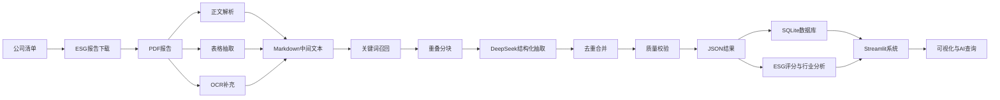
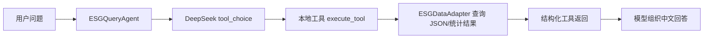

# ESG报告数据智能提取与分析系统技术文档

本文档基于当前仓库源码重新整理。当前评审和演示系统只有 **Streamlit 应用**，主入口为 `streamlit_app.py`、`app.py` 和 `python run.py app`。旧版单文件网页产物与相关构建脚本已经移除，本文档不再描述旧交付方式。

## 1. 项目目标

项目目标是将上市公司公开披露的 ESG 报告、可持续发展报告、社会责任报告等 PDF 文档，转化为结构化、可查询、可对比、可审计的 ESG 数据资产，并通过 Streamlit 系统完成展示与智能查询。

核心能力包括：

- 从公司清单批量检索和下载 ESG 报告 PDF。
- 使用 PDF 文本解析、表格抽取和 OCR 补充生成中间文本。
- 基于 52 个 E/S/G 指标和 DeepSeek 大模型抽取定量、定性指标。
- 对抽取结果进行字段、数值、状态、完整度和质量分校验。
- 将 JSON 结果导入 SQLite，形成可查询的数据资产。
- 通过 Streamlit 展示首页概览、数据质量、公司详情、指标对比、ESG 分析、趋势分析、AI 智能助手和数据管理页面。

当前 `data/output` 结果统计如下：

| 项目 | 当前值 |
|---|---:|
| 结构化结果 JSON | 492 份 |
| 覆盖公司 | 489 家 |
| 定量抽取条目 | 12,154 条 |
| 定性抽取条目 | 7,976 条 |
| 定量有效条目 | 12,146 条 |
| 定性有效条目 | 7,968 条 |
| 平均质量分 | 0.689 |
| 平均完整度 | 78.7% |

## 2. 总体架构



系统分为六层：

| 层级 | 说明 | 关键文件 |
|---|---|---|
| 数据采集层 | 生成公司清单并下载公开报告 | `scripts/generate_company_list.py`, `src/collector/downloader.py` |
| 预处理层 | 将 PDF 转为文本、表格和 OCR 补充内容 | `src/preprocessor/pdf_parser.py`, `src/preprocessor/table_extractor.py`, `src/preprocessor/ocr.py` |
| 抽取层 | 基于指标体系和 Prompt 调用 DeepSeek | `src/extractor/indicators.py`, `src/extractor/prompts.py`, `src/extractor/extractor.py` |
| 校验层 | 校验字段、数值范围、状态和完整度 | `src/extractor/validator.py` |
| 数据层 | JSON 结果与 SQLite 数据库 | `data/output/`, `data/esg_data.db`, `src/utils/db.py` |
| 应用层 | Streamlit 可视化和 AI 助手 | `streamlit_app.py`, `src/app/main.py`, `src/app/pages/ai_assistant.py` |

## 3. 运行入口

### 3.1 命令入口 `run.py`

`run.py` 是整个项目的数据流水线入口，它把下载、预处理、抽取、校验、入库、分析和启动应用封装为统一命令。

```bash
python run.py download
python run.py preprocess
python run.py extract
python run.py validate
python run.py db-import
python run.py analyze
python run.py app
python run.py all
```

核心命令映射来自 `run.py`：

```python
commands = {
    "download": cmd_download,
    "preprocess": cmd_preprocess,
    "extract": cmd_extract,
    "validate": cmd_validate,
    "db-import": cmd_db_import,
    "analyze": cmd_analyze,
    "app": cmd_app,
    "all": cmd_all,
}
```

其中 `cmd_app()` 启动 Streamlit 主应用：

```python
def cmd_app():
    """启动可视化应用"""
    import subprocess
    app_path = BASE_DIR / "src" / "app" / "main.py"
    subprocess.run(["streamlit", "run", str(app_path)])
```

`cmd_all()` 串联主流程：

```python
def cmd_all():
    print("\n[1/4] 下载ESG报告...")
    cmd_download()

    print("\n[2/4] 预处理PDF...")
    cmd_preprocess()

    print("\n[3/4] 大模型提取指标...")
    cmd_extract()

    print("\n[4/4] 校验并导入数据库...")
    cmd_validate()
    cmd_db_import()
```

### 3.2 Streamlit Cloud 入口 `streamlit_app.py`

该文件用于部署时让 Streamlit 正确执行 `src/app/main.py`。

```python
BASE_DIR = Path(__file__).parent
sys.path.insert(0, str(BASE_DIR))

app_path = BASE_DIR / "src" / "app" / "main.py"
with open(app_path, "r", encoding="utf-8") as f:
    code = f.read()

exec(compile(code, str(app_path), "exec"), {
    "__name__": "__main__",
    "__file__": str(app_path),
})
```

### 3.3 本地轻量入口 `app.py`

`app.py` 直接运行 Streamlit 主应用文件：

```python
if __name__ == "__main__":
    import runpy
    runpy.run_path(str(Path(__file__).parent / "src" / "app" / "main.py"))
```

## 4. 环节一：公司清单生成

脚本：`scripts/generate_company_list.py`

作用：通过 AkShare 获取 A 股公司代码和简称，生成 `data/company_list.csv`，供后续下载器批量检索报告。

方法：

1. 调用 `ak.stock_info_a_code_name()` 获取 A 股基础列表。
2. 使用 `get_exchange()` 根据股票代码首位判断交易所。
3. 输出 `code,name,exchange,market` 字段。

关键代码：

```python
import akshare as ak

def get_exchange(code: str) -> tuple:
    prefix = code[0]
    if prefix == "6":
        return ("SSE", "沪市")
    return ("SZSE", "深市")

def main():
    df = ak.stock_info_a_code_name()
    with open(OUTPUT_PATH, "w", newline="", encoding="utf-8") as f:
        writer = csv.writer(f)
        writer.writerow(["code", "name", "exchange", "market"])
        for _, row in df.iterrows():
            code = str(row["code"]).zfill(6)
            name = str(row["name"]).strip()
            exchange, market = get_exchange(code)
            writer.writerow([code, name, exchange, market])
```

输入输出：

| 项目 | 内容 |
|---|---|
| 输入 | AkShare A 股列表 |
| 输出 | `data/company_list.csv` |
| 后续环节 | `src/collector/downloader.py` 读取公司代码和名称 |

## 5. 环节二：ESG 报告下载

核心文件：`src/collector/downloader.py`

作用：从巨潮资讯网按公司代码、年份和 ESG 关键词检索公告，下载 PDF 报告，并记录下载日志。

### 5.1 数据源和关键词

数据源定义在 `src/collector/sources.py`，下载器使用 ESG 相关关键词进行公告检索。

```python
@dataclass
class DataSource:
    name: str
    base_url: str
    search_url: str
    description: str

CNINFO = DataSource(
    name="巨潮资讯网",
    base_url="http://www.cninfo.com.cn",
    search_url="http://www.cninfo.com.cn/new/fulltextSearch",
    description="A股官方信息披露平台，覆盖沪深两市所有上市公司公告"
)
```

### 5.2 下载器方法

`ESGReportDownloader` 的核心方法包括：

| 方法 | 作用 |
|---|---|
| `_load_company_list()` | 读取 `data/company_list.csv` |
| `search()` | 按股票代码和关键词调用公告搜索接口 |
| `_is_valid_announcement()` | 判断公告是否为有效 ESG 报告 |
| `download_pdf()` | 下载 PDF 并校验文件头 |
| `find_and_download_multi_year()` | 按年份范围选择并下载报告 |
| `run()` | 批量处理公司列表并保存日志 |

下载 PDF 的关键代码：

```python
def download_pdf(self, url: str, filepath: Path, stock_code: str = "") -> bool:
    resp = self.session.get(url, timeout=30, stream=True)
    resp.raise_for_status()

    first_bytes = next(resp.iter_content(chunk_size=10), b"")
    if not first_bytes.startswith(b"%PDF"):
        return False

    with open(filepath, "wb") as f:
        f.write(first_bytes)
        for chunk in resp.iter_content(chunk_size=8192):
            if chunk:
                f.write(chunk)
    return True
```

## 6. 环节三：PDF 预处理

预处理目标是把 PDF 转换为尽量保留语义的 Markdown 文本和表格结构，为大模型抽取提供稳定输入。

### 6.1 正文和表格联合解析

核心文件：`src/preprocessor/pdf_parser.py`

方法：

1. 优先使用 `pdfplumber` 解析每页文本。
2. 如果失败，回退到 PyMuPDF。
3. 对表格页调用 `page.extract_tables()`。
4. 将表格转为 Markdown 表格嵌入正文。
5. 输出 `.md` 和 `_tables.json`。

关键代码：

```python
def extract_text_with_tables(self, pdf_path: Path) -> str:
    parts = []
    with pdfplumber.open(str(pdf_path)) as pdf:
        for i, page in enumerate(pdf.pages):
            parts.append(f"--- 第{i+1}页 ---")
            tables = page.extract_tables()
            text = page.extract_text()
            if text:
                parts.append(text)
            if tables:
                for t_idx, table in enumerate(tables):
                    md_table = self._table_to_markdown(table)
                    if md_table:
                        parts.append(f"\n[表格 {t_idx+1}]\n{md_table}")
    return "\n\n".join(parts)
```

表格转 Markdown：

```python
def _table_to_markdown(self, table: list) -> str:
    clean_table = []
    for row in table:
        clean_row = [str(c).strip().replace("\n", " ") if c else "" for c in row]
        clean_table.append(clean_row)

    header = clean_table[0]
    lines = []
    lines.append("| " + " | ".join(h for h in header if h) + " |")
    lines.append("|" + "|".join(["---" for _ in header]) + "|")
    for row in clean_table[1:]:
        if any(cell for cell in row):
            lines.append("| " + " | ".join(cell for cell in row) + " |")
    return "\n".join(lines)
```

### 6.2 独立表格抽取

核心文件：`src/preprocessor/table_extractor.py`

方法：

- `extract_with_pdfplumber()`：适合常规 PDF 表格。
- `extract_with_camelot()`：作为复杂表格的补充方案。
- `find_esg_data_tables()`：根据 ESG 关键词筛选相关表格。
- `process_and_save()`：保存表格 JSON 和 Markdown。

### 6.3 OCR 补充

核心文件：`src/preprocessor/ocr.py`

方法：

- `is_scanned_pdf()` 判断 PDF 是否文本密度过低。
- `extract_texts_from_pdf_images()` 将页面转图片后进行 OCR。
- `extract_text_from_image()` 调用 OCR 引擎返回文本。

OCR 不是主路径，但对扫描报告或图片型页面提供兜底能力。

## 7. 环节四：ESG 指标体系

核心文件：`src/extractor/indicators.py`

系统使用 `ESGIndicator` 数据类定义指标元数据：

```python
@dataclass
class ESGIndicator:
    id: str
    name: str
    name_en: str
    dimension: str
    indicator_type: str
    unit: Optional[str] = None
    keywords: List[str] = field(default_factory=list)
    description: str = ""
```

指标体系分为三类：

| 维度 | 指标数量 | 示例 |
|---|---:|---|
| E 环境 | 18 | 温室气体排放总量、范围1排放、综合能源消耗、环保投入金额、气候变化应对策略 |
| S 社会 | 19 | 员工总数、女性员工比例、研发投入金额、安全生产投入、供应链 ESG 管理 |
| G 治理 | 15 | 董事会规模、独立董事比例、ESG 治理架构、反腐败与廉洁建设、信息披露质量 |

统计方法：

```python
ALL_INDICATORS = ENVIRONMENTAL_INDICATORS + SOCIAL_INDICATORS + GOVERNANCE_INDICATORS
QUANTITATIVE_INDICATORS = [i for i in ALL_INDICATORS if i.indicator_type == "quantitative"]
QUALITATIVE_INDICATORS = [i for i in ALL_INDICATORS if i.indicator_type == "qualitative"]
```

## 8. 环节五：Prompt 与大模型抽取

核心文件：`src/extractor/prompts.py`、`src/extractor/extractor.py`

### 8.1 Prompt 设计

Prompt 要求模型输出稳定 JSON，避免生成普通摘要。字段包含指标 ID、名称、数值、单位、状态、原文证据和置信度。

构建入口：

```python
def build_system_prompt() -> str:
    return """你是一个专业的ESG报告数据提取专家..."""

def build_combined_prompt() -> str:
    lines = []
    lines.append("请从以下ESG报告片段中提取所有相关指标...")
    lines.append("{report_chunk}")
    return "\n".join(lines)
```

### 8.2 关键词召回

`ESGExtractor._extract_combined()` 会先按 E/S/G 关键词筛选相关段落，减少无关文本进入模型。

```python
all_keywords = {
    "E": ["排放", "碳", "能源", "环境", "水", "废", "绿", "气候"],
    "S": ["员工", "培训", "安全", "性别", "公益", "研发", "供应链"],
    "G": ["董事会", "独立董事", "ESG治理", "反腐", "合规", "风险"],
}

paragraphs = report_text.split("\n")
scored = []
for para in paragraphs:
    if len(para.strip()) < 10:
        continue
    score = sum(1 for kw in all_kw if kw in para)
    if score > 0:
        scored.append((score, para))
```

### 8.3 重叠分块

分块参数定义在 `src/extractor/extractor.py`：

```python
CHUNK_SIZE = 15000
CHUNK_OVERLAP = 500
```

分块方法会优先在段落、换行或句号处切开，避免硬截断：

```python
def _chunk_text(self, text: str) -> list:
    chunks = []
    start = 0
    while start < len(text):
        end = start + CHUNK_SIZE
        chunk = text[start:end]
        split_pos = max(
            chunk.rfind("\n\n"),
            chunk.rfind("\n"),
            chunk.rfind("。"),
            chunk.rfind("."),
        )
        if split_pos > CHUNK_SIZE * 0.5:
            end = start + split_pos + 1
            chunks.append(text[start:end])
        else:
            chunks.append(chunk)
        start = end - CHUNK_OVERLAP
    return chunks
```

### 8.4 DeepSeek 调用

初始化 OpenAI 兼容客户端：

```python
class ESGExtractor:
    def __init__(self, api_key: Optional[str] = None):
        key = api_key or DEEPSEEK_API_KEY
        if not key:
            raise ValueError("请设置DEEPSEEK_API_KEY环境变量或传入api_key参数")

        self.client = OpenAI(api_key=key, base_url=DEEPSEEK_BASE_URL)
        self.system_prompt = build_system_prompt()
```

抽取入口：

```python
def extract_from_text(self, report_text: str, company_name: str = "",
                      report_year: str = "", dimension: Optional[str] = None,
                      fast_mode: bool = True) -> dict:
    if fast_mode and dimension is None:
        all_results = self._extract_combined(report_text, company_name, report_year)
    else:
        # 分维度抽取
        ...

    all_results["quantitative_indicators"] = self._deduplicate(
        all_results["quantitative_indicators"], is_quantitative=True
    )
    all_results["qualitative_indicators"] = self._deduplicate(
        all_results["qualitative_indicators"], is_quantitative=False
    )
    return all_results
```

### 8.5 批量抽取

`batch_extract()` 会遍历 `data/extracted/*.md`，调用模型抽取并写入 `data/output/*_result.json`。抽取完成后同步进行质量校验和完整度统计。

```python
validation = validator.validate(result)
completeness = validator.check_completeness(result)
result["validation"] = validation
result["completeness"] = completeness
```

## 9. 环节六：质量校验

核心文件：`src/extractor/validator.py`

校验内容包括：

| 类型 | 校验内容 |
|---|---|
| 定量指标 | 指标 ID、名称、数值、单位、数值类型、合理范围 |
| 定性指标 | 指标 ID、状态枚举、摘要字段 |
| 整体结果 | 有效条目数、问题列表、质量分、完整度 |

质量分计算代码：

```python
covered_count = sum(
    1 for item in qt_indicators + ql_indicators
    if item.get("value") is not None or item.get("status")
)
quality_score = min(
    1.0,
    (covered_count / max(len(ALL_INDICATORS), 1)) * 0.5
    + (qt_valid / max(qt_total, 1)) * 0.25
    + (ql_valid / max(ql_total, 1)) * 0.25,
)
```

完整度计算：

```python
def check_completeness(self, extraction_result: dict) -> dict:
    extracted_ids = set()
    for item in extraction_result.get("quantitative_indicators", []):
        extracted_ids.add(item.get("id"))
    for item in extraction_result.get("qualitative_indicators", []):
        extracted_ids.add(item.get("id"))

    missing = []
    for ind in ALL_INDICATORS:
        if ind.id not in extracted_ids:
            missing.append({"id": ind.id, "name": ind.name, "type": ind.indicator_type})

    return {
        "total_indicators": len(ALL_INDICATORS),
        "extracted": len(extracted_ids),
        "missing": len(missing),
        "missing_list": missing,
        "completeness": round(len(extracted_ids) / len(ALL_INDICATORS) * 100, 1),
    }
```

## 10. 环节七：数据库入库

核心文件：`src/utils/db.py`

数据库使用 SQLAlchemy ORM，主要表包括：

| 表 | 类 | 内容 |
|---|---|---|
| companies | `Company` | 公司代码、名称、行业、交易所 |
| reports | `Report` | 报告年份、路径、状态、质量分、完整度 |
| indicators | `Indicator` | 指标定义 |
| extracted_values | `ExtractedValue` | 定量指标值、单位、置信度、证据 |
| extracted_texts | `ExtractedText` | 定性指标状态、摘要、证据 |

入库入口：

```python
def import_results_from_json(db: Optional[Database] = None) -> dict:
    db = db or Database()
    db.import_indicators(ALL_INDICATORS)
    for json_file in OUTPUT_DIR.glob("*_result.json"):
        with open(json_file, "r", encoding="utf-8") as f:
            result = json.load(f)
        # 解析公司、报告、指标并写入数据库
```

保存结果时，数据库会把定量和定性指标分别写入不同表，方便后续查询和统计。

## 11. 环节八：ESG 分析

核心文件：`src/analyzer.py`

分析模块读取 `data/output` 中的 JSON，生成干净的 DataFrame，再计算公司评分、行业统计和洞察报告。

### 11.1 数据加载

```python
def load_clean_data() -> pd.DataFrame:
    rows = []
    for f in sorted(OUTPUT_DIR.glob("*_result.json")):
        with open(f, "r", encoding="utf-8") as fp:
            r = json.load(fp)
        company = r.get("company_name", "")
        validation = r.get("validation", {})
        completeness = r.get("completeness", {})
        quality = validation.get("overall_quality_score", 0)
        coverage = completeness.get("completeness", 0)
        ...
    return pd.DataFrame(rows)
```

### 11.2 ESG 评分

`compute_esg_scores()` 按公司汇总 E/S/G 指标，并根据指标方向进行归一化。环境维度中部分排放类指标越低越好，可再生能源、环保投入等指标越高越好。

```python
E_LOWER_IS_BETTER = {"E_Q01", "E_Q02", "E_Q03", "E_Q04", "E_Q07", "E_Q08", "E_Q09"}
E_HIGHER_IS_BETTER = {"E_Q06", "E_Q10"}
```

输出内容：

| 文件 | 内容 |
|---|---|
| `data/analysis/esg_scores.csv` | 公司 ESG 综合评分与排名 |
| `data/analysis/industry_analysis.csv` | 行业覆盖、均值和差异 |
| `data/analysis/insights.csv` | 自动生成的数据洞察 |
| `data/analysis/analysis_report.md` | 分析报告 |

## 12. 环节九：Streamlit 主系统

核心文件：`src/app/main.py`

### 12.1 页面配置和样式

系统设置宽屏布局，并配置中文字体和 Plotly 默认主题。

```python
st.set_page_config(
    page_title="ESG数据智能提取与分析系统",
    page_icon="🌱",
    layout="wide",
    initial_sidebar_state="expanded",
)
```

图表中文字体模板：

```python
_chinese_font = "Microsoft YaHei, PingFang SC, WenQuanYi Micro Hei, Noto Sans CJK SC, SimHei, sans-serif"
_font_template = go.layout.Template()
_font_template.layout.font.family = _chinese_font
pio.templates["esg_chinese"] = _font_template
pio.templates.default = "esg_chinese"
```

### 12.2 数据加载策略

Streamlit 应用优先读取 SQLite，如果数据库不可用则回退读取 JSON。

```python
def load_all_results() -> list:
    db = get_db()
    if db:
        try:
            return _load_from_database(db)
        except Exception:
            pass
    return _load_from_json()
```

JSON 回退方法读取 `data/output`：

```python
def _load_from_json() -> list:
    results = []
    for f in sorted(OUTPUT_DIR.glob("*_result.json")):
        with open(f, "r", encoding="utf-8") as fp:
            results.append(json.load(fp))
    return results
```

### 12.3 页面导航

`NAV_LABELS` 定义系统页面：

```python
NAV_LABELS = {
    "首页概览": "首页概览",
    "数据质量": "数据质量",
    "公司详情": "公司详情",
    "指标对比": "指标对比",
    "ESG分析": "ESG分析",
    "趋势分析": "趋势分析",
    "AI智能助手": "AI智能助手",
    "数据管理": "数据管理",
}
```

侧边栏使用 `st.radio()` 切换页面：

```python
page = st.radio(
    "导航",
    list(NAV_LABELS.keys()),
    format_func=lambda p: NAV_LABELS[p],
)
```

### 12.4 首页概览

首页展示报告数量、公司数量、定量指标数、定性指标数和平均质量分。

```python
report_count = len(results) or 0
company_count = df["公司"].nunique() if not df.empty else 0
quantitative_count = len([i for i in ALL_INDICATORS if i.indicator_type == "quantitative"])
qualitative_count = len([i for i in ALL_INDICATORS if i.indicator_type == "qualitative"])
```

### 12.5 数据质量页

数据质量页使用 `src/app/data_quality.py` 的工具函数：

| 函数 | 作用 |
|---|---|
| `is_valid_quantitative()` | 判断定量指标是否有有效数值 |
| `is_valid_qualitative()` | 判断定性指标状态是否有效 |
| `count_valid_indicators()` | 汇总公司有效指标数 |
| `build_validation_detail()` | 构建校验明细 |
| `build_industry_coverage()` | 生成行业覆盖统计 |
| `filter_company_options()` | 过滤可选公司 |

### 12.6 公司详情与指标对比

公司详情页按公司筛选 JSON/数据库结果，展示定量指标表、定性指标表、质量分和覆盖度。指标对比页按指标 ID 聚合多家公司数据，使用 Plotly 绘制柱状图或折线图。

核心思路：

```python
df = build_dataframe(results)
selected_company = st.selectbox("选择公司", sorted(df["公司"].unique()))
company_df = df[df["公司"] == selected_company]
st.dataframe(company_df, use_container_width=True)
```

### 12.7 ESG 分析与趋势分析

ESG 分析页复用 `src/analyzer.py` 的评分结果；趋势分析页位于 `src/app/pages/trends.py`，读取华证评级季度数据和 JSON 指标历史值。

趋势页面关键方法：

| 函数 | 作用 |
|---|---|
| `load_huazheng_quarterly()` | 读取华证 ESG 季度评级数据 |
| `load_json_indicator_points()` | 从 JSON 抽取指标历史点 |
| `_annual_rating()` | 生成年度评级序列 |
| `_build_rating_chart()` | 构建评级趋势图 |
| `_indicator_trends()` | 生成指标趋势数据 |
| `render_trends_page()` | 渲染趋势分析页面 |

## 13. 环节十：AI 智能助手

核心文件：`src/app/pages/ai_assistant.py`、`src/agent/query_engine.py`、`src/agent/tools.py`、`src/agent/data_adapter.py`

### 13.1 查询架构

AI 助手不是直接让模型凭空回答，而是使用 DeepSeek Function Calling 调用本地查询工具。流程如下：



### 13.2 Agent 初始化

```python
class ESGQueryAgent:
    def __init__(self, adapter):
        if not DEEPSEEK_API_KEY:
            raise ValueError("未设置DEEPSEEK_API_KEY环境变量")
        from openai import OpenAI
        self.client = OpenAI(api_key=DEEPSEEK_API_KEY, base_url=DEEPSEEK_BASE_URL)
        self.adapter = adapter
        self.tools = TOOL_SCHEMAS
```

### 13.3 查询循环

```python
response = self.client.chat.completions.create(
    model=DEEPSEEK_MODEL,
    messages=messages,
    tools=self.tools,
    tool_choice="auto",
    temperature=0.3,
    max_tokens=2048,
    timeout=30,
)
```

工具调用后，`execute_tool()` 根据工具名分发到本地数据适配器：

```python
def execute_tool(name: str, arguments: dict, adapter) -> str:
    if name == "get_company_data":
        result = adapter.get_company_data(**arguments)
    elif name == "compare_companies":
        result = adapter.compare_companies(**arguments)
    elif name == "get_esg_scores":
        result = adapter.get_esg_scores(**arguments)
    return json.dumps(result, ensure_ascii=False)
```

### 13.4 数据适配器

`ESGDataAdapter` 读取 `data/output`，构建公司索引、指标索引、评分结果和行业分析结果，为工具调用提供统一查询层。

主要方法：

| 方法 | 作用 |
|---|---|
| `get_companies()` | 返回公司列表和质量摘要 |
| `get_indicators()` | 返回指标定义 |
| `get_company_data()` | 查询单家公司 ESG 数据 |
| `get_esg_scores()` | 返回 ESG 排名 |
| `compare_companies()` | 多公司指标对比 |
| `get_industry_analysis()` | 行业分析 |
| `get_trend()` | 公司指标趋势 |
| `get_data_overview()` | 数据总览 |

## 14. 目录与数据文件

```text
esg-analysis-push/
├── README.md
├── 技术文档.md
├── 使用说明.txt
├── run.py
├── app.py
├── streamlit_app.py
├── requirements.txt
├── setup.bat
├── start.bat
├── data/
│   ├── company_list.csv
│   ├── esg_data.db
│   ├── output/
│   └── analysis/
├── src/
│   ├── app/
│   ├── collector/
│   ├── preprocessor/
│   ├── extractor/
│   ├── agent/
│   ├── utils/
│   └── analyzer.py
├── scripts/
└── tests/
```

关键数据目录：

| 路径 | 内容 |
|---|---|
| `data/company_list.csv` | 公司清单 |
| `data/download_log.csv` | 下载日志 |
| `data/extracted/` | PDF 预处理后的 Markdown 和表格 JSON |
| `data/output/` | 大模型抽取后的结构化 JSON |
| `data/esg_data.db` | SQLite 数据库 |
| `data/analysis/` | 评分、行业分析、洞察和报告 |

## 15. 环境依赖

主系统依赖在 `requirements.txt`：

```text
streamlit>=1.45
plotly>=5.24
numpy>=1.26
pandas>=2.2
openai>=1.30
sqlalchemy>=2.0
python-dotenv>=1.1
```

可选依赖：

| 功能 | 依赖 |
|---|---|
| PDF 文本解析 | `pdfplumber`, `PyMuPDF` |
| 表格增强抽取 | `camelot` |
| OCR | `paddleocr` 或项目环境中可用的 OCR 组件 |
| 公司列表生成 | `akshare` |

## 16. 评审运行建议

1. 先执行 `pip install -r requirements.txt`。
2. 如需 AI 智能助手，创建 `.env` 并配置 `DEEPSEEK_API_KEY`。
3. 执行 `python run.py app` 启动 Streamlit 系统。
4. 在浏览器访问 `http://localhost:8501`。
5. 重点查看“首页概览”“数据质量”“公司详情”“指标对比”“ESG分析”“趋势分析”和“AI智能助手”。

## 17. 本次文档口径

当前文档只描述 Streamlit 系统和数据流水线。仓库已经删除废弃的旧单文件网页产物、旧构建脚本和错误截图临时文件，避免评审入口混乱。后续如果继续扩展，也建议以 Streamlit 系统作为主线维护。
